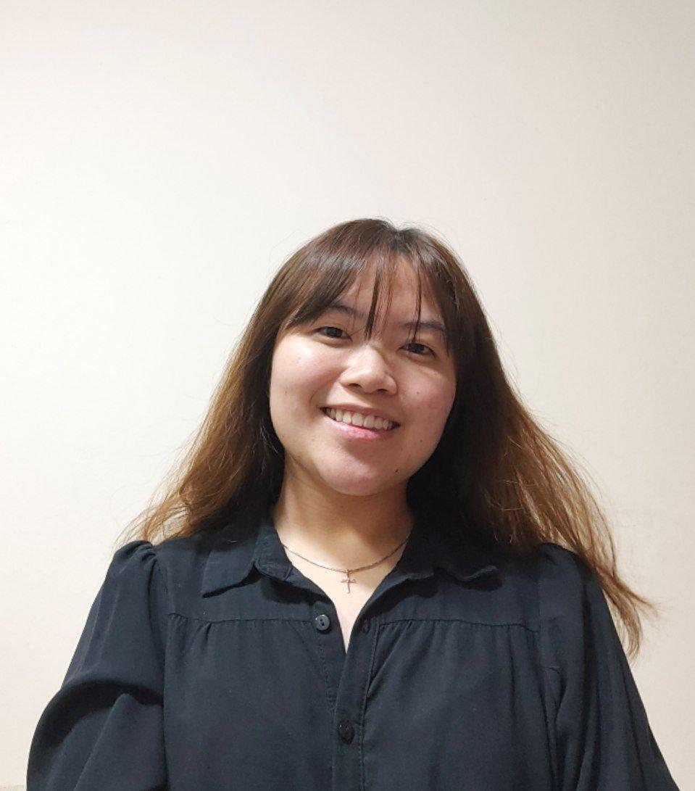
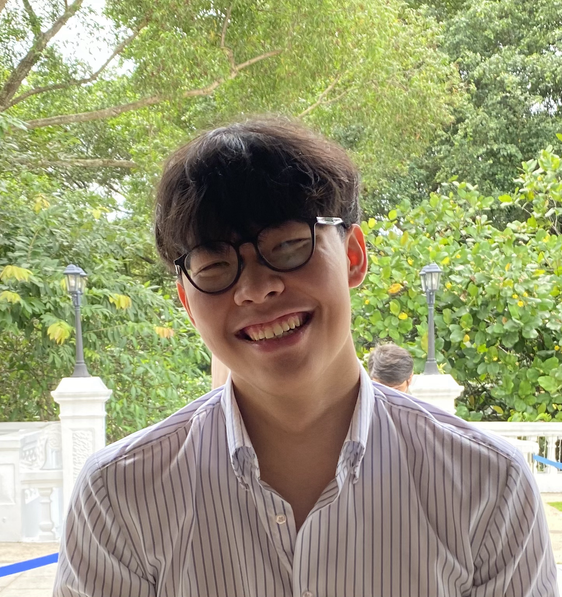
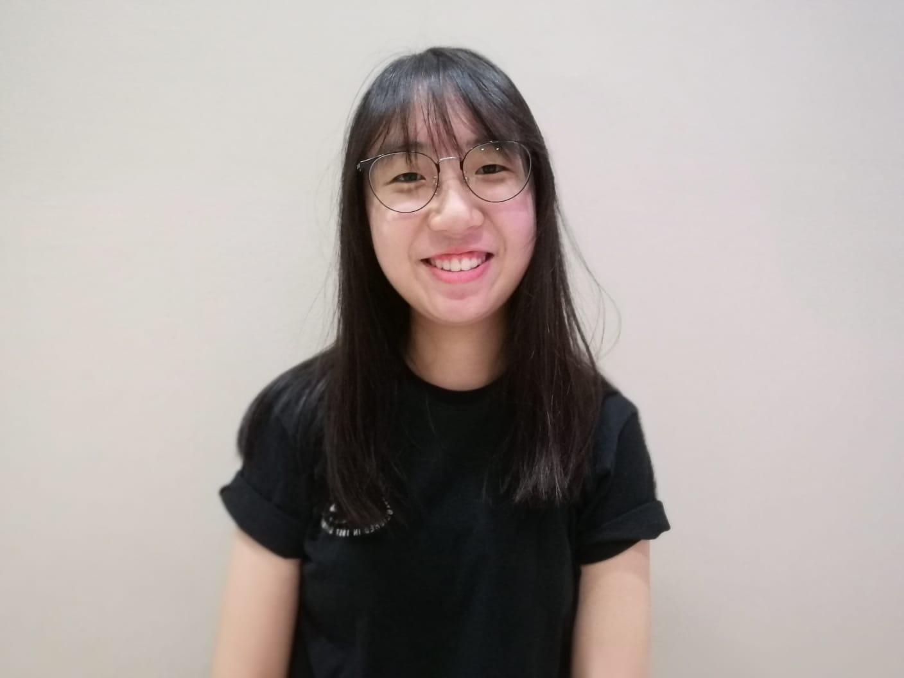

We are a team based in the [School of Computing, National University of Singapore](http://www.comp.nus.edu.sg).

You can reach us at the email `seer[at]comp.nus.edu.sg`

## Project team

### Joeie Tao

[[github](https://github.com/joeietao)]
[[portfolio](team/joeietao.md)]

* Role: Documentation

### Benjamin Seah

[[homepage](https://www.sbhbenjamin.works/)]
[[github](http://github.com/sbhbenjamin)]
[[portfolio](team/sbhbenjamin.md)]

* Role: Integration

### Thikhina Bakmeedeniya

[[github](http://github.com/thikhinab)] 
[[portfolio](team/thikhinab.md)]

* Role: Testing

### Jiang Zhengtao

[[github](http://github.com/ainsleyj)]
[[portfolio](team/ainsleyj.md)]

* Role: Code Quality

### Nicolle Gan

[[github](http://github.com/nicollegann)]
[[portfolio](team/nicollegann.md)]

* Role: Deliverables and Deadlines
