* Table of Contents
{:toc}

--------------------------------------------------------------------------------------------------------------------

## **Acknowledgements**

* {list here sources of all reused/adapted ideas, code, documentation, and third-party libraries -- include links to the original source as well}

--------------------------------------------------------------------------------------------------------------------

## **Setting up, getting started**

Refer to the guide [_Setting up and getting started_](SettingUp.md).

--------------------------------------------------------------------------------------------------------------------

## **Design**

:bulb: **Tip:** The `.puml` files used to create diagrams in this document can be found in the [diagrams](https://github.com/se-edu/addressbook-level3/tree/master/docs/diagrams/) folder. Refer to the [_PlantUML Tutorial_ at se-edu/guides](https://se-education.org/guides/tutorials/plantUml.html) to learn how to create and edit diagrams.

### Architecture

The ***Architecture Diagram*** given above explains the high-level design of the App.

Given below is a quick overview of main components and how they interact with each other.

**Main components of the architecture**

**`Main`** has two classes called [`Main`](https://github.com/AY2122S2-CS2103T-T09-1/tp/blob/master/src/main/java/seedu/address/Main.java) and [`MainApp`](https://github.com/AY2122S2-CS2103T-T09-1/tp/blob/master/src/main/java/seedu/address/MainApp.java). It is responsible for,
* At app launch: Initializes the components in the correct sequence, and connects them up with each other.
* At shut down: Shuts down the components and invokes cleanup methods where necessary.

[**`Commons`**](#common-classes) represents a collection of classes used by multiple other components.

The rest of the App consists of four components.

* [**`UI`**](#ui-component): The UI of the App.
* [**`Logic`**](#logic-component): The command executor.
* [**`Model`**](#model-component): Holds the data of the App in memory.
* [**`Storage`**](#storage-component): Reads data from, and writes data to, the hard disk.

**How the architecture components interact with each other**

The *Sequence Diagram* below shows how the components interact with each other for the scenario where the user issues the command `delete 1`.

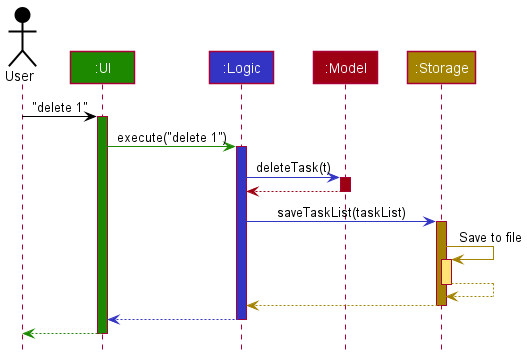

Each of the four main components (also shown in the diagram above),

* defines its *API* in an `interface` with the same name as the Component.
* implements its functionality using a concrete `{Component Name}Manager` class (which follows the corresponding API `interface` mentioned in the previous point.

For example, the `Logic` component defines its API in the `Logic.java` interface and implements its functionality using the `LogicManager.java` class which follows the `Logic` interface. Other components interact with a given component through its interface rather than the concrete class (reason: to prevent outside component's being coupled to the implementation of a component), as illustrated in the (partial) class diagram below.

The sections below give more details of each component.

### UI component

The **API** of this component is specified in [`Ui.java`](https://github.com/se-edu/addressbook-level3/tree/master/src/main/java/seedu/address/ui/Ui.java)

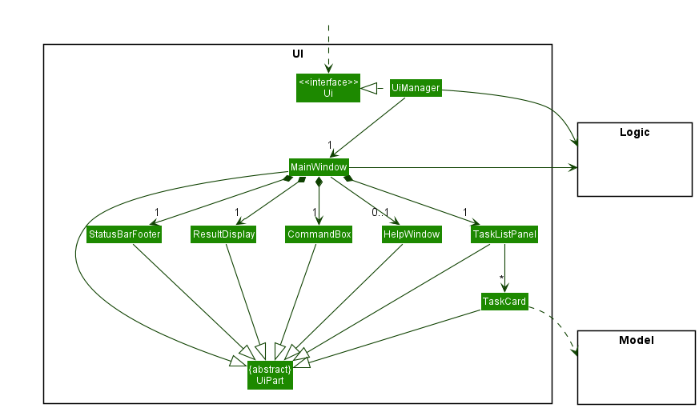

The UI consists of a `MainWindow` that is made up of parts e.g.`CommandBox`, `ResultDisplay`, `PersonListPanel`, `StatusBarFooter` etc. All these, including the `MainWindow`, inherit from the abstract `UiPart` class which captures the commonalities between classes that represent parts of the visible GUI.

The `UI` component uses the JavaFx UI framework. The layout of these UI parts are defined in matching `.fxml` files that are in the `src/main/resources/view` folder. For example, the layout of the [`MainWindow`](https://github.com/se-edu/addressbook-level3/tree/master/src/main/java/seedu/address/ui/MainWindow.java) is specified in [`MainWindow.fxml`](https://github.com/se-edu/addressbook-level3/tree/master/src/main/resources/view/MainWindow.fxml)

The `UI` component,

* executes user commands using the `Logic` component.
* listens for changes to `Model` data so that the UI can be updated with the modified data.
* keeps a reference to the `Logic` component, because the `UI` relies on the `Logic` to execute commands.
* depends on some classes in the `Model` component, as it displays `Person` object residing in the `Model`.

### Logic component

**API** : [`Logic.java`](https://github.com/se-edu/addressbook-level3/tree/master/src/main/java/seedu/address/logic/Logic.java)

Here's a (partial) class diagram of the `Logic` component:

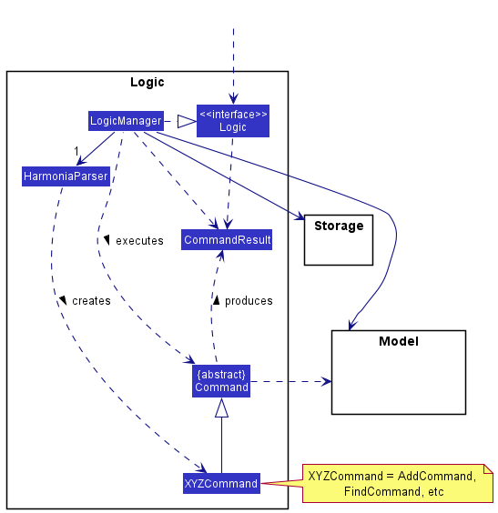

How the `Logic` component works:
1. When `Logic` is called upon to execute a command, it uses the `AddressBookParser` class to parse the user command.
1. This results in a `Command` object (more precisely, an object of one of its subclasses e.g., `AddCommand`) which is executed by the `LogicManager`.
1. The command can communicate with the `Model` when it is executed (e.g. to add a person).
1. The result of the command execution is encapsulated as a `CommandResult` object which is returned back from `Logic`.

The Sequence Diagram below illustrates the interactions within the `Logic` component for the `execute("delete 1")` API call.

:information_source: **Note:** The lifeline for `DeleteCommandParser` should end at the destroy marker (X) but due to a limitation of PlantUML, the lifeline reaches the end of diagram.

Here are the other classes in `Logic` (omitted from the class diagram above) that are used for parsing a user command:

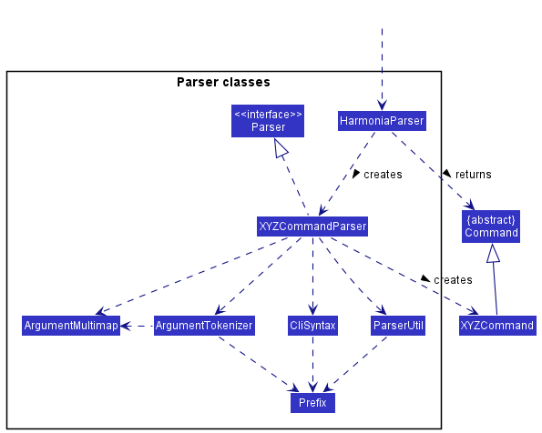

How the parsing works:
* When called upon to parse a user command, the `AddressBookParser` class creates an `XYZCommandParser` (`XYZ` is a placeholder for the specific command name e.g., `AddCommandParser`) which uses the other classes shown above to parse the user command and create a `XYZCommand` object (e.g., `AddCommand`) which the `AddressBookParser` returns back as a `Command` object.
* All `XYZCommandParser` classes (e.g., `AddCommandParser`, `DeleteCommandParser`, ...) inherit from the `Parser` interface so that they can be treated similarly where possible e.g, during testing.

### Model component
**API** : [`Model.java`](https://github.com/AY2122S2-CS2103T-T09-1/tp/blob/master/src/main/java/seedu/address/model/Model.java)

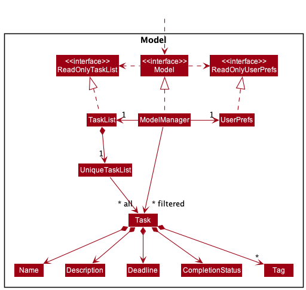

The `Model` component,

* stores the task list data i.e., all `Task` objects (which are contained in a `UniqueTaskList` object).
* stores the currently 'selected' `Task` objects (e.g., results of a search query) as a separate _filtered_ list which is exposed to outsiders as an unmodifiable `ObservableList<Task>` that can be 'observed' e.g. the UI can be bound to this list so that the UI automatically updates when the data in the list change.
* stores a `UserPref` object that represents the user’s preferences. This is exposed to the outside as a `ReadOnlyUserPref` objects.
* does not depend on any of the other three components (as the `Model` represents data entities of the domain, they should make sense on their own without depending on other components)

:information_source: **Note:** An alternative (arguably, a more OOP) model is given below. It has a `Tag` list in the `TaskList`, which `Task` references. This allows `TaskList` to only require one `Tag` object per unique tag, instead of each `Task` needing their own `Tag` objects. 

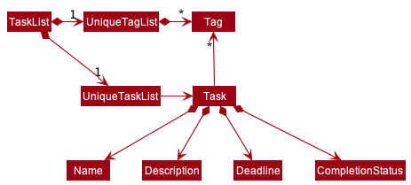

### Storage component

**API** : [`Storage.java`](https://github.com/se-edu/addressbook-level3/tree/master/src/main/java/seedu/address/storage/Storage.java)

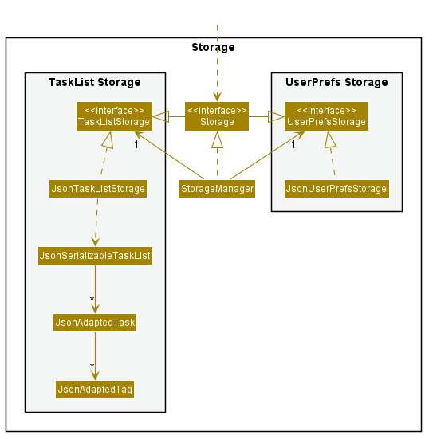

The `Storage` component,
* can save both address book data and user preference data in json format, and read them back into corresponding objects.
* inherits from both `AddressBookStorage` and `UserPrefStorage`, which means it can be treated as either one (if only the functionality of only one is needed).
* depends on some classes in the `Model` component (because the `Storage` component's job is to save/retrieve objects that belong to the `Model`)

### Common classes

Classes used by multiple components are in the `seedu.addressbook.commons` package.

--------------------------------------------------------------------------------------------------------------------

## **Implementation**

This section describes some noteworthy details on how certain features are implemented.

### \[Proposed\] Mass Operations

#### What is the feature about
This feature provides a way for users to mark and unmark multiple `Tasks` at a time. For the current implementation of
mark and unmark, users have to type in a command for each task that they wish to mark or unmark, one at a time.

#### How the feature is implemented

The feature is to be implemented with the addition of a `MassOpsParser` class which parses through user inputs
consisting of multiple indexes and processes the indexes to return an `ArrayList` of `Indexes` for `MarkCommand` and
`UnmarkCommand` to execute on.

##### MassOperations: Marking tasks
Given below is an example usage scenario of how the MassOps mechanism behaves at each step to mark tasks in
the task list.

Step 1. User inputs `mark 1 2 3` to unmark tasks 1, 2 and 3 of the task list.

Step 2. Upon receiving the user's input, `LogicManager` calls `HarmoniaParser#parseCommand()` to parse the user input.

Step 3. The first word of the user input is `mark`, which matches the command for `MarkCommand`.

Step 4. `MarkCommandParser#parse()` is called and `MassOpsParser#massOpsProcessor` is invoked to process the user input
into `indexes`, an `ArrayList<Index>` containing the indexes to be marked.

Step 5. `MarkCommand` is invoked upon `indexes` and returned to LogicManager.

Step 6. After `MarkCommand#execute()` is executed, Harmonia retrieves each task to be marked from `lastShowList` and
`createMarkedTask` is called to mark each task respectively.

Step 7. Each command result is stored in `markedTasks` which is returned and displayed to the user at the
end of the execution.

##### MassOperations: Unmarking tasks
Given below is an example usage scenario of how the MassOps mechanism behaves at each step to unmark tasks in
the task list.

Step 1. User inputs `unmark 1 2 3` to mark tasks 1, 2 and 3 of the task list.

Step 2. Upon receiving the user's input, `LogicManager` calls `HarmoniaParser#parseCommand()` to parse the user input.

Step 3. The first word of the user input is `unmark`, which matches the command for `UnmarkCommand`.

Step 4. `UnmarkCommandParser#parse()` is called and `MassOpsParser#massOpsProcessor` is invoked to process the user
input to be stored temporarily in `indexes`, an `ArrayList<Index>` containing the indexes to be unmarked.

Step 5. `UnmarkCommand` is invoked upon `indexes` and returned to LogicManager.

Step 6. After `UnmarkCommand#execute()` is executed, `model#updateFilteredTaskList()` is invoked to get the updated task
list, from which Harmonia will retrieve the respective tasks to be unmarked.

Step 7. Each command result is stored in an `ArrayList` which is returned and displayed to the user.

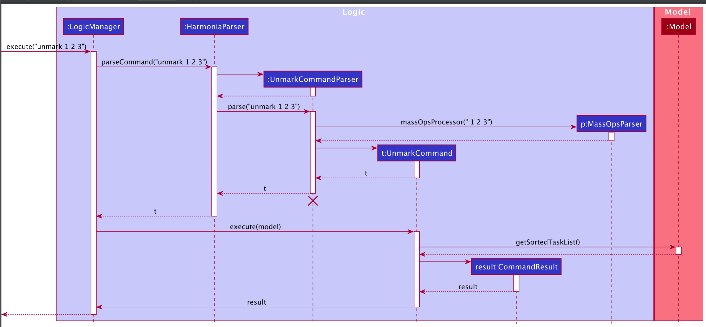

#### Design considerations:

**Aspect: The number of indexes to be marked/unmarked at a time**

* **Alternative 1 (current choice):** Ignore case and only allow users to mark or unmark tasks one at a time.
    * Pros:
        * Easy to implement.
        * Consistent with how delete and find are working now, just deleting one task and finding one keyword at a time.
        * Ensures that there is no confusion in which tasks are successfully marked or unmarked and which tasks are unsuccessfully marked or unmarked when multiple indexes are provided in the command
    * Cons:
        * May be very time-consuming for the user and becomes less user-friendly as the user has to manually mark or
        * unmark multiple tasks one at a time if they want to do it in batches

### Priority

#### What is the feature about
Provides a way to attach priorities to `Tasks`. The current implementation allows it to be set to 3 values: `low`, `medium` and `high`.

#### How the feature is implemented
The feature was implemented using an `enum` class. To maintain consistency with other properties among the `Task`, the class was also implemented with `isValidPriority()` that functions as a validity checker and `valueOfLabel()` to retrieve the enum constant corresponding to a given `String` input.

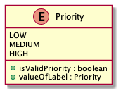

#### Why it is implemented that way
The design of the priority feature was built using an enum as a `Priority` is only designed to support one out of a small set of possible values – in this case, `low`, `medium` and `high`. Appropriately, the `enum` type enables us to define a finite set of values, providing a higher level of type-safety as compared to literal values such as `String` or `Integer`.

In this case, the `enum` type also increases the extensibility of the feature. If we wanted to add more fields to the priority (i.e. `lower` and `higher`), all we have to do is to add those fields as `enum` constants.

#### Design considerations:

**Aspect: How the priority is saved:**

* **Alternative 1 (current choice):** Use an enum.
    * Pros:
      * Allows for code that is clearer and more readable
      * More extensible
      * Compile-time type safety
      * Reduction in memory-use. When we create a new object, we only refer to the static `enum` constant, instead of creating a new `Priority` object.
    * Cons: -
* **Alternative 2:** Use `int` or `String`
  itself.
    * Pros:
      * Easier to write (in the beginning)
    * Cons:
      * Lacks compile-time type safety
      * Using an integer to represent a priority level could be less descriptive as to what it exactly represents
      * More tedious to extend. To implement this, we might have to use conditionals to check if the `String` or `int` input corresponds with the accepted values in our `Priority` design. This can pose a problem when we try to extend the number of properties a `Priority` field can take. In this case, we might have to increase the number of conditionals, which could reduce readability and make the code more prone to errors.
      * Possibly increases memory use. If we use `String` or `int` types, we might have to instantiate new `Priority` classes every time we create a new `Task` object.

### Mark/unmark feature

#### What is the feature about
Provides a way to mark `Task` objects as either completed or uncompleted.

#### How the feature is implemented
The first stage of the implementation `mark` feature involves parsing the user input. `MarkCommandParser` is used to parse and check whether the user input is valid. After which a `MarkCommand` object is created with the respective task index. The second stage requires `MarkCommand#execute()` to be called. The execution would update `TaskList` by replacing task to be marked by the copy of it with the `CompletionStatus` set to `true`.

The `unmark` feature follows a similar implementation involving `UnmarkCommandParser`, `UnmarkCommand`.

#### Why it is implemented that way
It is designed to preserve the Command Design Pattern. Through the implementation of the `MarkCommmandParser` and `UnmarkCommandParser`, we can enforce the input format of mark command. Furthermore, isolating `MarkCommand` and `UnmarkCommand` into separate classes, we narrow down functionality of each class. This gives the application more control by limiting the outcome in successful execution. For example, successful execution of MarkCommand will only lead to the task being marked as complete.Whereas an alternative design combining mark and unmark functionality together will lead vague outcome (application unaware whether the task is marked as complete or incomplete after execution).

#### Design considerations:

**Aspect: How the functionality of mark/unmark is broken down:**

* **Alternative 1 (current choice):** Use two separate Command classes: `MarkCommand` and `UnmarkCommand`.
    * Pros:
        * More control over the final outcome of the Command execution (Knowledge whether task is completed or uncompleted after execution)
        * Ability to check whether a task is either `MarkCommand` or `UnamrkCommand` during runtime
        * Ability to extend either mark or unmark functionality isolated from each other
      * Cons:
        * Makes the code more bloated with similar looking code (for each class)
* **Alternative 2:** Use a single `Command` to toggle `Task` as either complete or incomplete.
    * Pros:
        * Less redundant code
        * Easier to extend if both mark and unmark are required to change synchronously
    * Cons:
        * No exact knowledge whether the execution of command mark task as complete or incomplete

### \[Proposed\] Search by date

#### What is the feature about
Supports the searching of tasks by a date range. If the deadline of a task falls within the specified time range, it is displayed in the result.

#### How the feature is implemented
This feature will be incorporated with the current `FindCommand`. By adding additional checks for flags (`/start` and `/end`) in the FindCommandParser, the tasks will be filtered accordingly. A new `TimeRangePredicate` class will be added to abstract out the details on time range. Hence, the predicate will be applied to the filtered task list that is displayed to the user.

Additionally, there will be checks for duplicate start and end date, such that the user can specify one start date and one end date at most.

#### Why it is implemented that way
Searching based on a time range is a similar operation to `find`, hence it is intuitive to incorporate them. The presence of start/end date is optional, to provide more flexibility. However, we do not allow multiple start/end date, to avoid confusion.

#### Design considerations:

**Aspect: Command to be used for searching by date:**

* **Alternative 1 (current choice):** Incorporate with the original `find` (current choice).
    * Pros:
        * Does not increase the size of the command set.
        * More intuitive, as the user does not have to remember another similar command.
    * Cons:
        * The parsing of an `AddCommand` becomes slightly more complicated.
* **Alternative 2:** Create a new command `search`
  itself.
    * Pros:
        * Less modification on current implementation.
    * Cons:
        * Increase the size of command sets.
        * Could cause confusion with another similar command `find`, which compromises user experience.

### Search by tags

#### What is the feature about

This feature allows the user to search for tasks with at least one of its tag matching the specified keyword.

#### How the feature is implemented

The search by tags feature uses the `find` command and prefix `t/` before the keyword.

Given below is an example usage scenario of how the find mechanism behaves at each step to search for tasks by tags:

Step 1. User inputs `find t/CS2103T` to find tasks that have a 'CS2103T' tag.

Step 2. Upon receiving the user's input, `LogicManager` calls `HarmoniaParser#parseCommand()` to parse the user input.

Step 3. The first word of the user input is `find`, which matches the command for `FindCommand`. This initialises `FindCommandParser`.

Step 4. `FindCommandParser#parse()` is called and keywords with prefix `t/` are extracted out as a list of keywords to search for. This list of keywords are used to initialise a `TagContainsKeywordPredicate`.

Step 5. A `FindCommand` is initialised using the `TagContainsKeywordPredicate` and returned to `LogicManager` for execution.

Step 6. After `FindCommand#execute()` is called, `model#updateFilteredTaskList()` is invoked to filter the task list using the given `TagContainsKeywordPredicate`. The command result is returned and displayed to the user.

The following is the sequence diagram summarising the above steps:

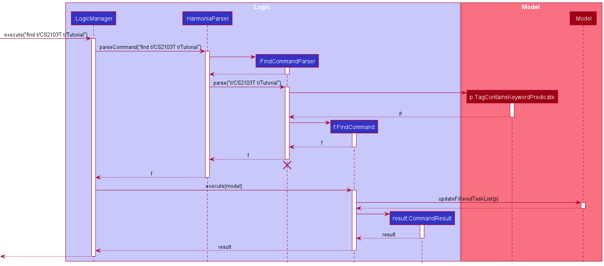

#### Design considerations:

**Aspect: How tags are matched:**

* **Alternative 1 (current choice):** Ignore case and require full match with at least one of the task's tags.
    * Pros:
      * Easy to implement.
      * Consistent with how keywords are matched with task names in the search by keywords feature.
      * Gives the most specific list of tasks if the user is able to remember the exact tag that one is searching for.
    * Cons:
      * May not find any match if users only enter a part of the tag (e.g. `cs2103` will not match with `cs2103t`).

* **Alternative 2:** Ignore case and allow partial match with at least one of the task's tags.
    * Pros:
      * Gives a list of possible tasks even if the user is unable to remember the exact full tag.
    * Cons:
      * More difficult to implement.
      * May give additional tasks that the user is not searching for (e.g. user searches for tasks with tag `data` but result list shows all tasks with tags `data` and `database`).

**Aspect: User does not specify tag after `t/` prefix:**

* **Alternative 1 (current choice):** Ignores the empty tag. `find t/` gives an empty result list. `find t/cs2103t t/` gives a list of tasks with tag `cs2103t`.
    * Pros:
      * If user searches for multiple tags, the valid tags will still be matched.
    * Cons:
      * No error message to inform user on invalid tag.

* **Alternative 2:** Ignores other valid tags and outputs an error message to inform user on invalid command format.
    * Pros:
      * Ensures user does not unintentionally leave a tag value empty.
    * Cons:
      * Other valid tags are not matched until user corrects command.

### List Tags

#### What is the feature about

Provides a way to view a list of all tags currently in use in the task list. This feature complements the other features where users can view the tags that are in use before executing the other commands such as `add`, `edit` and `find`.

#### How the feature is implemented

This feature enhances the `list` command, with an additional parameter `t/`. There is a `TagList` that stores all tags currently in use in the task list. This `TagList` is initialised upon start-up of Harmonia and is updated accordingly after every `add`, `edit` and `clear` command. When the user inputs the `list t/` command, the `TagList` is retrieved and displayed to the user.

Given below is an example usage scenario of how the list tags feature behaves at each step:

Step 1. User inputs `list t/` to view all tags that are used in the task list.

Step 2. Upon receiving the user input, `LogicManager` calls `HarmoniaParser#parseCommand()` to parse the user input.

Step 3. As the first word of the user input is `list`, `ListCommandParser` is initialised.

Step 4. `ListCommandParser#parse()` is called. Since `t/` is specified in the user input, a `ListCommand` is initialised, with `isListTag` set to `true`. `isListTag` is a boolean which specifies whether the user’s input is a command to list tags (`isListTag = true`) or to list tasks (`isListTag = false`). The `ListCommand` is then returned to `LogicManager` for execution.

Step 5. `ListCommand#execute()` is called. Since `isListTag` is set to `true`, `model#getTagList()` is invoked to get the list of tags currently in use in the task list. This list of tags is used to initialise a `CommandResult`, which is returned and displayed to the user.

The following is the sequence diagram summarising the above steps:

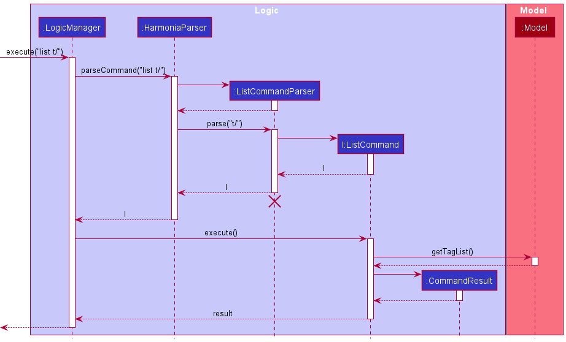

#### Design considerations:

**Aspect: How the tag list is initialised:**

* **Alternative 1 (current choice):** Initialise the tag list upon start-up of Harmonia based on the stored task list.
    * Pros:
      * Easier to implement.
      * Ensures that the tag list will be consistent with the data in task list.
    * Cons:
      * Upon each start-up of Harmonia, all tasks in the task list have to be iterated through to retrieve their tags so as to initialise the tag list. This may increase the start-up duration of the application.

* **Alternative 2:** Store the data of the tag list as a separate JSON file and load the data upon start-up of Harmonia.
    * Pros:
      * Reduces the application start-up duration as the data of the tag list can directly be loaded from the JSON file.
    * Cons:
      * May result in inconsistencies between tags stored in the tag list and tags used in the task list. For example, if the user were to manually make changes to one of the JSON files without making the corresponding changes to the other JSON file. As such, additional checks may need to be put in place to ensure that the data in the tag list is consistent with that of the task list.

### \[Proposed\] Undo/redo feature

#### Proposed Implementation

The proposed undo/redo mechanism is facilitated by `VersionedTaskList`. It extends `TaskList` with an undo/redo history, stored internally as a `taskListStateList` and `currentStatePointer`. Additionally, it implements the following operations:

* `VersionedTaskList#commit()` — Saves the current task list state in its history.
* `VersionedTaskList#undo()` — Restores the previous task list state from its history.
* `VersionedTaskList#redo()` — Restores a previously undone task list state from its history.

These operations are exposed in the `Model` interface as `Model#commitTaskList()`, `Model#undoTaskList()` and `Model#redoTaskList()` respectively.

Given below is an example usage scenario and how the undo/redo mechanism behaves at each step:

Step 1. The user launches the application for the first time. The `VersionedTaskList` will be initialized with the initial task list state, and the `currentStatePointer` pointing to that single task list state.

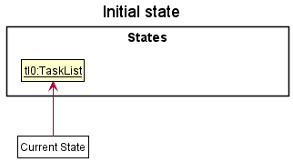

Step 2. The user executes `delete 5` command to delete the 5th task in the task list. The `delete` command calls `Model#commitTaskList()`, causing the modified state of the task list after the `delete 5` command executes to be saved in the `taskListStateList`, and the `currentStatePointer` is shifted to the newly inserted task list state.

Step 3. The user executes `add n/tutorial …​` to add a new task. The `add` command also calls `Model#commitTaskList()`, causing another modified task list state to be saved into the `taskListStateList`.

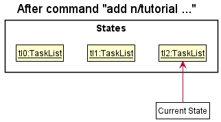

:information_source: **Note:** If a command fails its execution, it will not call `Model#commitTaskList()`, so the task list state will not be saved into the `taskListStateList`.

Step 4. The user now decides that adding the task was a mistake, and decides to undo that action by executing the `undo` command. The `undo` command will call `Model#undoTaskList()`, which will shift the `currentStatePointer` once to the left, pointing it to the previous task list state, and restores the task list to that state.

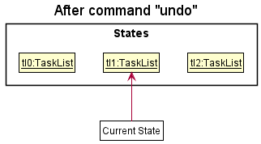

:information_source: **Note:** If the `currentStatePointer` is at index 0, pointing to the initial TaskList state, then there are no previous TaskList states to restore. The `undo` command uses `Model#canUndoTaskList()` to check if this is the case. If so, it will return an error to the user rather
than attempting to perform the undo.

The following sequence diagram shows how the undo operation works:

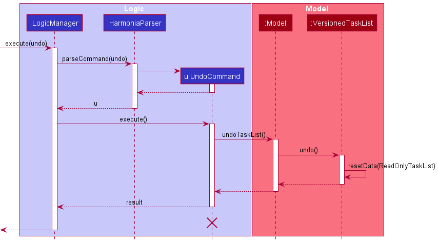

:information_source: **Note:** The lifeline for `UndoCommand` should end at the destroy marker (X) but due to a limitation of PlantUML, the lifeline reaches the end of diagram.

The `redo` command does the opposite — it calls `Model#redoTaskList()`, which shifts the `currentStatePointer` once to the right, pointing to the previously undone state, and restores the task list to that state.

:information_source: **Note:** If the `currentStatePointer` is at index `taskListStateList.size() - 1`, pointing to the latest task list state, then there are no undone TaskList states to restore. The `redo` command uses `Model#canRedoTaskList()` to check if this is the case. If so, it will return an error to the user rather than attempting to perform the redo.

Step 5. The user then decides to execute the command `list`. Commands that do not modify the task list, such as `list`, will usually not call `Model#commitTaskList()`, `Model#undoTaskList()` or `Model#redoTaskList()`. Thus, the `taskListStateList` remains unchanged.

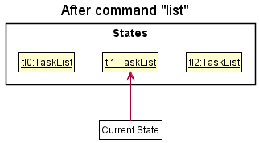

Step 6. The user executes `clear`, which calls `Model#commitTaskList()`. Since the `currentStatePointer` is not pointing at the end of the `taskListStateList`, all task list states after the `currentStatePointer` will be purged. Reason: It no longer makes sense to redo the `add n/tutorial …​` command. This is the behavior that most modern desktop applications follow.

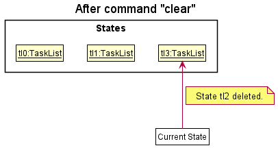

The following activity diagram summarizes what happens when a user executes a new command:

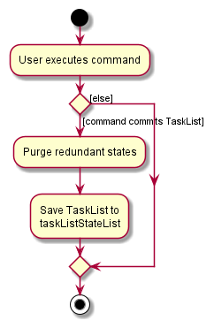

#### Design considerations:

**Aspect: How undo & redo executes:**

* **Alternative 1 (current choice):** Saves the entire task list.
    * Pros: Easy to implement.
    * Cons: May have performance issues in terms of memory usage.

* **Alternative 2:** Individual command knows how to undo/redo by
  itself.
    * Pros: Will use less memory (e.g. for `delete`, just save the task being deleted).
    * Cons: We must ensure that the implementation of each individual command are correct.

--------------------------------------------------------------------------------------------------------------------

## **Documentation, logging, testing, configuration, dev-ops**

* [Documentation guide](Documentation.md)
* [Testing guide](Testing.md)
* [Logging guide](Logging.md)
* [Configuration guide](Configuration.md)
* [DevOps guide](DevOps.md)

--------------------------------------------------------------------------------------------------------------------

## **Appendix: Requirements**

### Product scope

**Target user profile**:
* students who have a need to manage a significant number of tasks of different types
* prefer desktop apps over other types
* can type fast
* prefers typing to mouse interactions
* is reasonably comfortable using CLI apps

**Value proposition**:
Harmonia is the easiest way for students to manage the complexity associated with their schooling years – from the plethora of assignments, ad-hoc consultations and events, to deadlines. This app will only help to manage tasks, and does not act as a calendar notifying the user of any upcoming event/deadline.

### User stories

Priorities: High (must have) - `* * * *`, Medium (nice to have) - `* * *`, Medium-low (nice to have but difficult) - `* *`, Low (unlikely to have) - `*`

| Priority  | As a …​        | I want to …​                                                | So that I can…​                                                                |
|-----------|----------------|-------------------------------------------------------------|--------------------------------------------------------------------------------|
| `* * * *` | user           | add a new task                                              |                                                                                |
| `* * * *` | user           | delete a task                                               | remove tasks that I no longer need                                             |
| `* * * *` | user           | mark a task as complete                                     |                                                                                |
| `* * * *` | user           | mark a task as incomplete                                   |                                                                                |
| `* * * *` | user           | see all my tasks when I start up the application            | view my tasks more conveniently without having to perform any extra operations |
| `* * * *` | user           | tag a task                                                  | categorise my tasks according to my preferred system                           |
| `* * * *` | user           | modify a task                                               | amend a mistake or update a task                                               |
| `* * * *` | user           | search by tags                                              | find tasks related to a category                                               |
| `* * * *` | user           | search by keywords                                          | find a specific task more easily                                               |
| `* * * *` | new user       | have straightforward commands I can use                     | use the application more intuitively                                           |
| `* * * *` | expert user    | modify the tasks in the data file directly                  | modify the tasks in a way that is not supported by the application             |
| `* * *`   | user           | tag a task with multiple tags                               | categorise tasks under multiple categories at a time                           |
| `* * *`   | user           | search for tasks that fall within a specific time range     | find the tasks that lie between a specific period                              |
| `* * *`   | user           | view upcoming deadlines                                     | prioritise what tasks I need to do first                                       |
| `* * *`   | user           | view tags I have already added when creating a new task     | know how to tag new tasks and avoid creating similar tags                      |
| `* * *`   | user           | view all of my upcoming–deadlines and longer-term deadlines | have a more holistic view of all events in the short-term and long-term future |
| `* * *`   | user           | access the user guide through the interface                 | access the documentation without having to search online for it                |
| `* * *`   | user           | sort my tasks by certain filters                            | organise my view the way I prefer                                              |
| `* * *`   | user           | label my tasks with priorities                              | keep track of which tasks are more important                                   |
| `* * *`   | new user       | view suggestions if I type in the wrong command             | recover from mistakes and use the correct command more easily                  |
| `* * *`   | potential user | see the app populated with sample data                      | easily see how the application would look like when in use                     |
| `* *`     | user           | set repeated occurrence of a task                           | avoid having to add a task multiple times                                      |
| `* *`     | new user       | revert changes made                                         | undo changes that were made by mistake                                         |
| `* *`     | expert user    | use shortcuts                                               | perform operations more efficiently                                            |
| `*`       | user           | bulk mark different tasks as complete                       | marking everything I finished a day with just one command                      |
| `*`       | expert user    | delete multiple tasks at once                               | do not have to delete tasks one by one                                         |

### Use cases

(For all use cases below, the **System** is `Harmonia` and the **Actor** is the `user`, unless specified otherwise)

**Use case: UC01 - Add a task**

**MSS**
1. User chooses to add a task.
2. User enters the task description.
3. Harmonia adds the task.
4. Harmonia informs the user that the task has been successfully added.

    Use case ends.

**Extensions**
* 2a. Harmonia detects an error in the entered request.
    * 2a1. Harmonia outputs an error message.
    * 2a2. User enters a new request.
    Steps 2a1-2a2 are repeated until valid request is inputted.
    Use case resumes from step 3.

 

**Use case: UC02 - Delete a task**

**MSS**
1. User chooses to remove a task from the task list.
2. User enters the request to remove the task.
3. Harmonia deletes the task.
4. Harmonia informs the user that the task has been successfully deleted.

    Use case ends.

**Extensions**
* 2a. Harmonia detects an error in the entered request.
    * 2a1. Harmonia outputs an error message.
    * 2a2. User enters a new request.
  Steps 2a1-2a2 are repeated until valid request is inputted.
  Use case resumes from step 3.

 

**Use case: UC03 - Mark a task as complete**

**MSS**
1. User chooses to mark a task as complete from the task list.
2. User enters the request to mark a task based on its index in the task list.
3. Harmonia marks the task as complete.
4. Harmonia informs the user that the task has been successfully marked.

    Use case ends.

**Extensions**
* 2a. Harmonia detects an error in the entered request.
    * 2a1. Harmonia outputs an error message.
    * 2a2. User enters a new request.
  Steps 2a1-2a2 are repeated until valid request is inputted.
  Use case resumes from step 3.

 

**Use case: UC04 - Unmark a task from completion**

**MSS**
1. User chooses to unmark a task from completion from the task list.
2. User enters the request to unmark a task based on its index in the task list.
3. Harmonia marks the task as incomplete.
4. Harmonia informs the user that the task has been successfully unmarked.

    Use case ends.

**Extensions**
* 2a. Harmonia detects an error in the entered request.
    * 2a1. Harmonia outputs an error message.
    * 2a2. User enters a new request.
  Steps 2a1-2a2 are repeated until valid request is inputted.
  Use case resumes from step 3.

 

**Use case: UC05 - Add a tag to the task**

**MSS**
1. User chooses to add a tag to an existing task.
2. User enters the request to add the tag to the task.
3. Harmonia adds the tag to the task.
4. Harmonia informs the user that the tag has been successfully added to the task.

    Use case ends.

**Extensions**
* 2a. Harmonia detects an error in the entered request.
    * 2a1. Harmonia outputs an error message.
    * 2a2. User enters a new request.
  Steps 2a1-2a2 are repeated until valid request is inputted.
  Use case resumes from step 3.

 

**Use case: UC06 - Edit a task**

**MSS**
1. User chooses to edit a task from the task list.
2. User enters the request to edit the task with the updated details.
3. Harmonia updates the task.
4. Harmonia informs the user that the task has been successfully updated.

    Use case ends.

**Extensions**
* 2a. Harmonia detects an error in the entered request.
    * 2a1. Harmonia outputs an error message.
    * 2a2. User enters a new request.
  Steps 2a1-2a2 are repeated until valid request is inputted.
  Use case resumes from step 3.

 

**Use case: UC07 - List all tasks**

**MSS**
1. User chooses to list out all tasks.
2. User enters the request to list all tasks.
3. Harmonia lists out all tasks.

    Use case ends.

**Extensions**
* 2a. Harmonia detects an error in the entered request.
    * 2a1. Harmonia outputs an error message.
    * 2a2. User enters a new request.
  Steps 2a1-2a2 are repeated until valid request is inputted.
  Use case resumes from step 3.

 

**Use case: UC08 - Search for a task by keyword/tag**

**MSS**
1. User enters the request to search for task(s) by keyword/tag.
2. Harmonia shows a list of tasks that match the specified keyword/tag.
3. Harmonia informs the user that the search result has been displayed successfully.

    Use case ends.

**Extensions**
* 2a. Harmonia detects that the keyword is missing.
    * 2a1. Harmonia outputs an error message.
    * 2a2. User enters a new command.
  Steps 2a1-2a2 are repeated until valid data is inputted.
  Use case resumes from step 3.

* 2b. Harmonia detects that the tag does not exist.
    * 2b1. Harmonia outputs an error message.
    * 2b2. User enters a new command.
  Steps 2a1-2a2 are repeated until valid data is inputted.
  Use case resumes from step 3.

 

**Use case: UC09 - Undo the previous change**

**Preconditions:** Changes were made by the user.

**MSS**
1. User chooses to undo the previous change.
2. User enters the request to undo the previous change.
3. Harmonia restores the state before the previous change.

    Use case ends.

**Extensions**
* 2a. Harmonia is unable to recognize the request entered by the user.
    * 2a1. Harmonia outputs an error message.
    * 2a2. User enters a new request.
  Steps 2a1-2a2 are repeated until valid request is inputted.
  Use case resumes from step 3.

 

**Use case: UC10 - Search for tasks within date range**

**MSS**
1. User chooses to search for tasks that fall within a specific date range.
2. User enters the request to search for the tasks by date range.
3. Harmonia displays the tasks that match the criteria.
4. Harmonia informs the user that the result has been displayed successfully.

    Use case ends.

**Extensions**
* 2a. Harmonia detects an error in the entered request.
    * 2a1. Harmonia outputs an error message.
    * 2a2. User enters a new request.
  Steps 2a1-2a2 are repeated until valid request is inputted.
  Use case resumes from step 3.

 

**Use case: UC11 - Sort tasks**

**MSS**
1. User chooses to sort the task by a certain property.
2. User enters the request to sort the task based on a property.
3. Harmonia displays the tasks based on the property.
4. Harmonia informs the user that the sort has been performed successfully.

    Use case ends.

**Extensions**
* 2a. Harmonia detects an error in the entered request.
    * 2a1. Harmonia outputs an error message.
    * 2a2. User enters a new request.
  Steps 2a1-2a2 are repeated until valid request is inputted.
  Use case resumes from step 3.

 

**Use case: UC12 - Set repeated occurrences of a task**

**MSS**
1. User chooses to set repeated occurrences of a task.
2. User enters the request to set repeated occurrences of a task.
3. Harmonia sets the task as a repeated occurrence.
4. Harmonia informs the user that the task has been added as a repeated occurrence.

    Use case ends.

**Extensions**
* 2a. Harmonia detects an error in the entered request.
    * 2a1. Harmonia outputs an error message.
    * 2a2. User enters a new request.
      Steps 2a1-2a2 are repeated until valid request is inputted.
      Use case resumes from step 3.

 

**Use case: UC13 - Categorise task according to priority**

**MSS**
1. User chooses to assign a priority to a task.
2. User enters the request to assign priority to the task.
3. Harmonia assigns priority to the task.
4. Harmonia informs the user that the priority of the task has been updated.

    Use case ends.

**Extensions**
* 2a. Harmonia detects an error in the entered request.
    * 2a1. Harmonia outputs an error message.
    * 2a2. User enters a new request.
      Steps 2a1-2a2 are repeated until valid request is inputted.
      Use case resumes from step 3.

 

**Use case: UC14 - View user guide**

**MSS**
1. User chooses to view the user guide.
2. User requests to view the user guide.
3. Harmonia outputs a message with a URL to the user guide.
4. User copies the URL to the user guide.

    Use case ends.

**Extensions**
* 2a. Harmonia detects an error in the entered request.
    * 2a1. Harmonia outputs an error message.
    * 2a2. User enters a new request.
      Steps 2a1-2a2 are repeated until valid request is inputted.
      Use case resumes from step 3.

 

**Use case: UC15 - Add multiple tags to a task**

**MSS**
1. User chooses to add multiple tags to an existing task.
2. User requests to add multiple tags to a task.
3. Harmonia adds the different tags to the task.
4. Harmonia informs the user that the tags have been successfully added to the task.

    Use case ends.

**Extensions**
* 2a. Harmonia detects an error in the entered request.
    * 2a1. Harmonia outputs an error message.
    * 2a2. User enters a new request.
      Steps 2a1-2a2 are repeated until valid request is inputted.
      Use case resumes from step 3.

### Non-Functional Requirements

1. Should work on most *Mainstream* OS as long as it has Java `11` or above installed.
2. Should be able to accomplish most of the tasks faster using commands than using the mouse by users with above average typing speed for regular English text (i.e. not code, not system admin commands)
3. Should respond within two seconds.
4. Should be usable by a novice who has never used Harmonia before.
5. Is not required to remind users about upcoming deadlines or events.

### Glossary

* **Mainstream OS**: Windows, Linux, Unix, OS-X
* **Task**: A piece of work that the user needs to complete
* **Tag**: A label or category attached to a task to give additional information to it
* **Keyword**: A word that the user queries to search for a task

--------------------------------------------------------------------------------------------------------------------

## **Appendix: Instructions for manual testing**

Given below are instructions to test the app manually.

:information_source: **Note:** These instructions only provide a starting point for testers to work on;
testers are expected to do more *exploratory* testing.

### Launch and shutdown

1. Initial launch

   1. Download the jar file and copy into an empty folder

   1. Double-click the jar file Expected: Shows the GUI with a set of sample contacts. The window size may not be optimum.

1. Saving window preferences

   1. Resize the window to an optimum size. Move the window to a different location. Close the window.

   1. Re-launch the app by double-clicking the jar file. 
       Expected: The most recent window size and location is retained.

1. _{ more test cases …​ }_

### Deleting a person

1. Deleting a person while all persons are being shown

   1. Prerequisites: List all persons using the `list` command. Multiple persons in the list.

   1. Test case: `delete 1` 
      Expected: First contact is deleted from the list. Details of the deleted contact shown in the status message. Timestamp in the status bar is updated.

   1. Test case: `delete 0` 
      Expected: No person is deleted. Error details shown in the status message. Status bar remains the same.

   1. Other incorrect delete commands to try: `delete`, `delete x`, `...` (where x is larger than the list size) 
      Expected: Similar to previous.

2. _{ more test cases …​ }_

### Saving data

1. Dealing with missing/corrupted data files

   1. _{explain how to simulate a missing/corrupted file, and the expected behavior}_

1. _{ more test cases …​ }_

