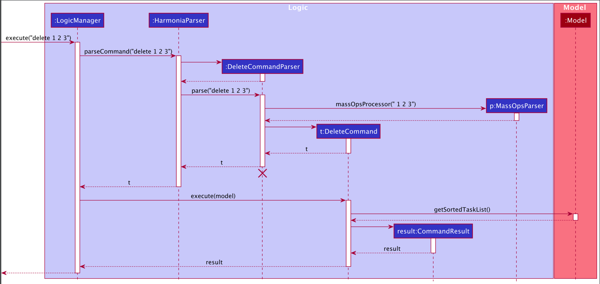
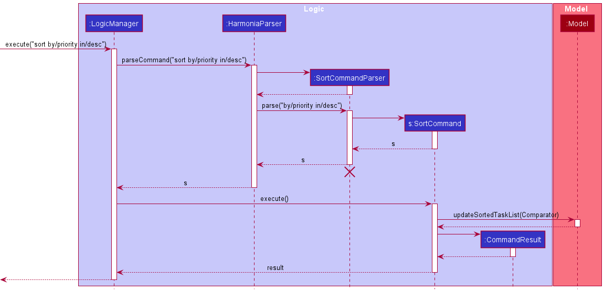
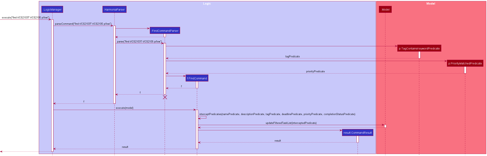

* Table of Contents
{:toc}

--------------------------------------------------------------------------------------------------------------------

## **Setting up, getting started**

Refer to the guide [_Setting up and getting started_](SettingUp.md).

--------------------------------------------------------------------------------------------------------------------

## **Design**

:bulb: **Tip:** The `.puml` files used to create diagrams in this document can be found in the [diagrams](https://github.com/se-edu/addressbook-level3/tree/master/docs/diagrams/) folder. Refer to the [_PlantUML Tutorial_ at se-edu/guides](https://se-education.org/guides/tutorials/plantUml.html) to learn how to create and edit diagrams.

### Architecture

The ***Architecture Diagram*** given above explains the high-level design of the App.

Given below is a quick overview of main components and how they interact with each other.

**Main components of the architecture**

**`Main`** has two classes called [`Main`](https://github.com/AY2122S2-CS2103T-T09-1/tp/blob/master/src/main/java/seedu/address/Main.java) and [`MainApp`](https://github.com/AY2122S2-CS2103T-T09-1/tp/blob/master/src/main/java/seedu/address/MainApp.java). It is responsible for,
* At app launch: Initializes the components in the correct sequence, and connects them up with each other.
* At shut down: Shuts down the components and invokes cleanup methods where necessary.

[**`Commons`**](#common-classes) represents a collection of classes used by multiple other components.

The rest of the App consists of four components.

* [**`UI`**](#ui-component): The UI of the App.
* [**`Logic`**](#logic-component): The command executor.
* [**`Model`**](#model-component): Holds the data of the App in memory.
* [**`Storage`**](#storage-component): Reads data from, and writes data to, the hard disk.

**How the architecture components interact with each other**

The *Sequence Diagram* below shows how the components interact with each other for the scenario where the user issues the command `delete 1`.

Each of the four main components (also shown in the diagram above),

* defines its *API* in an `interface` with the same name as the Component.
* implements its functionality using a concrete `{Component Name}Manager` class (which follows the corresponding API `interface` mentioned in the previous point.

For example, the `Logic` component defines its API in the `Logic.java` interface and implements its functionality using the `LogicManager.java` class which follows the `Logic` interface. Other components interact with a given component through its interface rather than the concrete class (reason: to prevent outside component's being coupled to the implementation of a component), as illustrated in the (partial) class diagram below.

The sections below give more details of each component.

### UI component

The **API** of this component is specified in [`Ui.java`](https://github.com/AY2122S2-CS2103T-T09-1/tp/blob/master/src/main/java/seedu/address/ui/Ui.java)

The UI consists of a `MainWindow` that is made up of parts e.g.`CommandBox`, `ResultDisplay`, `TaskListPanel`, `StatusBarFooter` etc. All these, including the `MainWindow`, inherit from the abstract `UiPart` class which captures the commonalities between classes that represent parts of the visible GUI.

The `UI` component uses the JavaFx UI framework. The layout of these UI parts are defined in matching `.fxml` files that are in the `src/main/resources/view` folder. For example, the layout of the [`MainWindow`](https://github.com/AY2122S2-CS2103T-T09-1/tp/blob/master/src/main/java/seedu/address/ui/MainWindow.java) is specified in [`MainWindow.fxml`](https://github.com/AY2122S2-CS2103T-T09-1/tp/blob/master/src/main/resources/view/MainWindow.fxml)

The `UI` component,

* executes user commands using the `Logic` component.
* listens for changes to `Model` data so that the UI can be updated with the modified data.
* keeps a reference to the `Logic` component, because the `UI` relies on the `Logic` to execute commands.
* depends on some classes in the `Model` component, as it displays `Task` object residing in the `Model`.

### Logic component

**API** : [`Logic.java`](https://github.com/AY2122S2-CS2103T-T09-1/tp/blob/master/src/main/java/seedu/address/logic/Logic.java)

Here's a (partial) class diagram of the `Logic` component:

How the `Logic` component works:
1. When `Logic` is called upon to execute a command, it uses the `HarmoniaParser` class to parse the user command.
1. This results in a `Command` object (more precisely, an object of one of its subclasses e.g., `AddCommand`) which is executed by the `LogicManager`.
1. The command can communicate with the `Model` when it is executed (e.g. to add a person).
1. The result of the command execution is encapsulated as a `CommandResult` object which is returned back from `Logic`.

The Sequence Diagram below illustrates the interactions within the `Logic` component for the `execute("delete 1")` API call.

:information_source: **Note:** The lifeline for `DeleteCommandParser` should end at the destroy marker (X) but due to a limitation of PlantUML, the lifeline reaches the end of diagram.

Here are the other classes in `Logic` (omitted from the class diagram above) that are used for parsing a user command:

How the parsing works:
* When called upon to parse a user command, the `HarmoniaParser` class creates an `XYZCommandParser` (`XYZ` is a placeholder for the specific command name e.g., `AddCommandParser`) which uses the other classes shown above to parse the user command and create a `XYZCommand` object (e.g., `AddCommand`) which the `HarmoniaParser` returns back as a `Command` object.
* All `XYZCommandParser` classes (e.g., `AddCommandParser`, `DeleteCommandParser`, ...) inherit from the `Parser` interface so that they can be treated similarly where possible e.g, during testing.

### Model component
**API** : [`Model.java`](https://github.com/AY2122S2-CS2103T-T09-1/tp/blob/master/src/main/java/seedu/address/model/Model.java)

The `Model` component,

* stores the task list data i.e., all `Task` objects (which are contained in a `UniqueTaskList` object).
* stores the currently 'selected' `Task` objects (e.g., results of a search query) as a separate _filtered_ list which is exposed to outsiders as an unmodifiable `ObservableList<Task>` that can be 'observed' e.g. the UI can be bound to this list so that the UI automatically updates when the data in the list change.
* stores a `UserPref` object that represents the user’s preferences. This is exposed to the outside as a `ReadOnlyUserPref` objects.
* does not depend on any of the other three components (as the `Model` represents data entities of the domain, they should make sense on their own without depending on other components)

:information_source: **Note:** An alternative (arguably, a more OOP) model is given below. It has a `Tag` list in the `TaskList`, which `Task` references. This allows `TaskList` to only require one `Tag` object per unique tag, instead of each `Task` needing their own `Tag` objects. 

### Storage component

**API** : [`Storage.java`](https://github.com/AY2122S2-CS2103T-T09-1/tp/blob/master/src/main/java/seedu/address/storage/Storage.java)

The `Storage` component,
* can save both task list data and user preference data in json format, and read them back into corresponding objects.
* inherits from both `TaskListStorage` and `UserPrefStorage`, which means it can be treated as either one (if only the functionality of only one is needed).
* depends on some classes in the `Model` component (because the `Storage` component's job is to save/retrieve objects that belong to the `Model`)

### Common classes

Classes used by multiple components are in the `seedu.address.commons` package.

--------------------------------------------------------------------------------------------------------------------

## **Implementation**

This section describes some noteworthy details on how certain features are implemented.

### Mass Operations

#### What is the feature about
This feature provides a way for users to `mark`, `unmark` and `delete` multiple `Tasks` at a time. For the previous implementation of `mark`, `unmark` and `delete`, users had to type in a command for each task that they wished to `mark`, `unmark` or `delete` one at a time.   

#### How the feature is implemented

These features are implemented with the addition of a `MassOpsParser` class which parses through user inputs, consisting of multiple indexes. `MassOpsParser` processes the indexes to return an `ArrayList` of `Indexes` for `MarkCommand`, `UnmarkCommand` or `DeleteCommand` to execute.

Given below is an example usage scenario of how the MassOps mechanism behaves at each step to `mark` tasks in the task list.

Step 1. User inputs `mark 1 2 3` to mark the tasks at the first, second and third index of the task list as completed.

Step 2. Upon receiving the user's input, `LogicManager` calls `HarmoniaParser#parseCommand()` to parse the user input.

Step 3. The first word of the user input is `mark`, which matches the command for `MarkCommand`.

Step 4. `MarkCommandParser#parse()` is called and `MassOpsParser#massOpsProcessor` is invoked to process the user input into a list of `Indexes`.

Step 5. A `MarkCommand` is initialised using the list of `indexes` and is returned to `LogicManager` for execution.

Step 6. After `MarkCommand#execute()` is executed, Harmonia looks through `lastShownList` to check the validity of marking the tasks at each inputted index.

Step 7. The valid indexes are stored in the `ArrayList`, `markTaskIndexes`, which is passed into `result()`.

Step 8. In `result()`, `createMarkedTask` is called to mark the tasks at each index stored in `markTaskIndexes` respectively.

Step 9. The result is converted into a string `markedTasksToString` which is used to initialise a `CommandResult` returned and displayed to the user.  

The `unmark` feature follows a similar implementation involving `UnmarkCommandParser` and `UnmarkCommand` instead.  

The `delete` feature follows a similar implementation as well, involving `DeleteCommandParser` and `DeleteCommand` instead.  

#### Design considerations:

**Aspect: How the user input is processed:**

* **Alternative 1 (current choice):** Create a separate `MassOpsParser` class to parse the user input
    * Pros:
      * Reduces similar looking code
      * Easier to introduce mass operations into other features in future
      * Abstracts the processing of user input from the respective commands, reducing chances of introducing errors into the different commands.
    * Cons: -
* **Alternative 2:** Process the user input using the respective command parser functions themselves
    * Pros:
      * More control over the way the indexes are processed (can order the indexes in a specific format for execution according to the command)
    * Cons:
      * Repetitive code
      * Makes it more difficult and time-consuming to apply mass operations to other features in future

### Priority

#### What is the feature about
Provides a way to attach priorities to `Tasks`. The current implementation allows it to be set to 3 values: `low`, `medium` and `high`.

#### How the feature is implemented
The feature was implemented using an `enum` class. To maintain consistency with other properties among the `Task`, the class was also implemented with `isValidPriority()` that functions as a validity checker and `valueOfLabel()` to retrieve the enum constant corresponding to a given `String` input.

#### Why it is implemented that way
The design of the priority feature was built using an enum as a `Priority` is only designed to support one out of a small set of possible values – in this case, `low`, `medium` and `high`. Appropriately, the `enum` type enables us to define a finite set of values, providing a higher level of type-safety as compared to literal values such as `String` or `Integer`.

In this case, the `enum` type also increases the extensibility of the feature. If we wanted to add more fields to the priority (i.e. `lower` and `higher`), all we have to do is to add those fields as `enum` constants.

#### Design considerations:

**Aspect: How the priority is saved:**

* **Alternative 1 (current choice):** Use an enum.
    * Pros:
      * Allows for code that is clearer and more readable
      * More extensible
      * Compile-time type safety
      * Reduction in memory-use. When we create a new object, we only refer to the static `enum` constant, instead of creating a new `Priority` object.
    * Cons: -
* **Alternative 2:** Use `int` or `String`
  itself.
    * Pros:
      * Easier to write (in the beginning)
    * Cons:
      * Lacks compile-time type safety
      * Using an integer to represent a priority level could be less descriptive as to what it exactly represents
      * More tedious to extend. To implement this, we might have to use conditionals to check if the `String` or `int` input corresponds with the accepted values in our `Priority` design. This can pose a problem when we try to extend the number of properties a `Priority` field can take. In this case, we might have to increase the number of conditionals, which could reduce readability and make the code more prone to errors.
      * Possibly increases memory use. If we use `String` or `int` types, we might have to instantiate new `Priority` classes every time we create a new `Task` object.

### Mark/unmark

#### What is the feature about
Provides a way to mark `Task` objects as either completed or uncompleted.

#### How the feature is implemented
The first stage of the implementation `mark` feature involves parsing the user input. `MarkCommandParser` is used to parse and check whether the user input is valid. After which a `MarkCommand` object is created with the respective task index. The second stage requires `MarkCommand#execute()` to be called. The execution would update `TaskList` by replacing task to be marked by the copy of it with the `CompletionStatus` set to `true`.

The `unmark` feature follows a similar implementation involving `UnmarkCommandParser`, `UnmarkCommand`.

The following activity diagram summarizes what happens when a user inputs `mark` command:

#### Why it is implemented that way
It is designed to preserve the Command Design Pattern. Through the implementation of the `MarkCommmandParser` and `UnmarkCommandParser`, we can enforce the input format of mark command. Furthermore, isolating `MarkCommand` and `UnmarkCommand` into separate classes, we narrow down functionality of each class. This gives the application more control by limiting the outcome in successful execution. For example, successful execution of MarkCommand will only lead to the task being marked as complete.Whereas an alternative design combining mark and unmark functionality together will lead vague outcome (application unaware whether the task is marked as complete or incomplete after execution).

#### Design considerations:

**Aspect: How the functionality of mark/unmark is broken down:**

* **Alternative 1 (current choice):** Use two separate Command classes: `MarkCommand` and `UnmarkCommand`.
    * Pros:
        * More control over the final outcome of the Command execution (Knowledge whether task is completed or uncompleted after execution)
        * Ability to check whether a task is either `MarkCommand` or `UnmarkCommand` during runtime
        * Ability to extend either mark or unmark functionality isolated from each other
      * Cons:
        * Makes the code more bloated with similar looking code (for each class)
* **Alternative 2:** Use a single `Command` to toggle `Task` as either complete or incomplete.
    * Pros:
        * Less redundant code
        * Easier to extend if both mark and unmark are required to change synchronously
    * Cons:
        * The final state of task's `CompletionStatus` after executing toggle command cannot be precisely known. (i.e. We only know the final outcome of the task's `CompletionStatus` during runtime. Whereas, having with two different commands, `MarkCommand` and `UnmarkCommand` we know for certain the final state of the `CompletionStatus` can be predicted.)  

### Sorting

#### What is the feature about
Sorts the tasks presented by specified attribute and order.

#### How the feature is implemented
The sort feature uses the `sort` command, prefix `by/` before the specified `SORT_KEY` and prefix `in/` before the specified `SORT_ORDER`.

Given below is an example usage scenario of how the sort mechanism behaves at each step to sort the task:

Step 1. User inputs `sort by/deadline in/asc` to sort the task list by the `Deadline` in the ascending order.
    
Step 2. Upon receiving the user's input, `LogicManager` calls `HarmoniaParser#parseCommand()` to parse the user input.

Step 3. The first word of the user input is `sort`, which matches the command for `SortCommand`. This initialises `SortCommandParser`.

Step 4. `SortCommandParser#parse()` is called. `SORT_KEY` with prefix `by/` and `SORT_ORDER` with prefix `in/` are extracted out as a `SortKey` and `SortOrder` objects.

Step 5. A `SortCommand` is initialised using the `SortKey` and `SortOrder`. The `SortCommand` constructor creates a `Comparator` used for sorting the list. `SortCommand` is returned to `LogicManager` for execution.

Step 6. After `SortCommand#execute()` is called, `model#updateSortedTaskList(Comparator)` is invoked to sort the task list using the created `Comparator`. The command result is returned and displayed to the user.

The following activity diagram summarizes what happens when a user inputs `sort` command:

#### Why it is implemented that way
The underlying `UniqueTaskList` uses an `ObservableList` and therefore it allows the application listen to changes and render according specified requirements. One such abstraction used in the initial implementation is the `FilteredList`. With the `FilteredList` the application grants the ability to filter the list using a `Predicate`. Sorting was designed to be an extension of this concept using `SortedList` abstraction where the application can sort the list by a given `Comparator` and render its output instantaneously.

#### Design considerations:
**Aspect: How the `Comparator` is created:**
* **Alternative 1 (current choice):** Use Factory design pattern.
    * Pros:
        * Easier to extend
        * Abstracts out the complexity of creating a `Comparator`
        * Promotes reuse of code as there is no need to repeat necessary conditions needed to create a `Comparator`
        * Easier to conduct Unit-testing as we only need to test the Factory to check whether the `Comparator` returned meets the correct type and the conditions.
        * Cons:
            * Makes the code verbose
* **Alternative 2:** Create `Comparator` at the point of parsing.
    * Pros:
        * Less code needed to implement
    * Cons:
        * Leads to poor code quality as `Comparator` creation becomes more complex. (For example: Poor quality may arise due to violations of KISS principle) 

**Aspect: How the sorted list is stored/rendered:**
* **Alternative 1 (current choice):** Use `javafx.collections.transformation.SortedList`.
    * Pros:
        * Abstracts out the details of rendering
        * Abstracts out the details behind sorting (i.e. only need to pass in the `Comparator`)
    * Cons:
        * Difficult to preserve the ordering if tasks are added or edited. Since `TaskList` is implemented using `ObservableList`, any changes to it would cause them to be propagated to the `SortedList` (which wraps the `ObservableList`). Therefore, adding/editing a `Task` would cause the contents to be automatically sorted. Hence, this might lead to tasks being reordered.
    
* **Alternative 2:** Sorts the tasks using a stream and repopulate the `TaskList`.
    * Pros:
        * Straightforward implementation
    * Cons:
        * Mutability may introduce latent bugs (For examples: Storage may be updated with `incorrect` tasks that may have been introduced when mutating the `TaskList` since saving to storage is dependent on `TaskList`)
        * Redundant computation to delete and reinsert the same tasks after each operation
        
### Search by various attributes

#### What is the feature about

This feature allows the user to search for tasks that meet the different criteria as specified in the input.

Currently, Harmonia allows user to search for tasks by

1. The deadline of a task, by specifying a range of date that deadline should fall into

2. The name of a task, by specifying keywords that should be contained by the name

3. The description of a task, by specifying keywords that should be contained by the description

4. The tag of a task

5. The priority of a task

6. The completion status of a task

Additionally, the fields above could be combined in a single query using `find`, to simplify the process of querying by multiple criteria.

#### How the feature is implemented

Overall, the workflow of finding a task can be generalized into 3 steps:

1. The `FindCommand` class accepts the parsed inputs as various predicates from the `FindCommandParser`.

   * The `FindCommandParser` makes use of various utility methods in `ParserUtil`, to parse the user input into several tokens that correspond to a type of input, e.g. `Keyword`, `CompletionStatus`, etc.

   * After parsing the user input into several tokens, the predicates are constructed to represent the criteria of filtering.

   * User inputs are seperated into several subgroups, since some fields allow multiple inputs. There are 6 subgroups of fields: tag(s), description keyword(s), name keyword(s), priority(s), date range, completion status.

   * Within each subgroup, if a task has a match, e.g. the name of the task contains only one of the name keywords specified, it is considered as a match, and the name predicate evaluates to true for this task.

   * Since all the fields in `find` are optional, all the predicates are able to handle null input. In the case of null input, the predicates always evaluate to true.
   
2. Then, the `FindCommand` chains the predicates up using AND, i.e. all the predicates must be evaluated to true, for a task to be displayed in the result.

3. Finally, the chained predicate is used to filter the tasks, and the tasks with the criteria met are displayed on the screen.

Given below is an example usage scenario of how the find mechanism behaves at each step to search for tasks:

Step 1. User inputs `find t/CS2103T t/CS2105 p/low` to find tasks that have a 'CS2103T' or 'CS2105' tag, and with a low priority.

Step 2. Upon receiving the user's input, `LogicManager` calls `HarmoniaParser#parseCommand()` to parse the user input.

Step 3. The first word of the user input is `find`, which matches the command for `FindCommand`. This initializes `FindCommandParser`.

Step 4. `FindCommandParser#parse()` is called. 

Step 5. For the fields that could only appear once, `FindCommandParser` checks whether they are present. If they are present, the value is extracted out and stored. Otherwise, null is assigned to them.

Step 6. For the fields that accept multiple occurrences, they are stored as a set. In this case, Tags with prefix `t/` are extracted out as a list of keywords, and the priority `low` with prefix `p/` is also extracted out and stored as a list, as multiple priorities are allowed in general.

Step 7. For each subgroup, the corresponding predicate is initialized, and used to initialize a `FindCommand`.

Step 8. `FindCommand` then proceeds to chain the predicates up using AND.

Step 9. After `FindCommand#execute()` is called using the predicate created at step 8, `model#updateFilteredTaskList()` is invoked to filter the task list using the given predicate. The command result is returned and displayed to the user.

The following is the sequence diagram summarizing the above steps:

Note: the creation process of some predicates is omitted, to simplify the diagram. In the diagram, only the creation process of `TagContainsKeywordPredicate` and `PriorityMatchedPredicate` are included.

#### Design considerations:

**Aspect: Command to be used for searching various fields:**

* **Alternative 1 (current choice):** Use single `find` that supports multiple fields.

    * Pros:
        * Does not increase the size of the command set.
        * More intuitive, as the user does not have to remember other similar commands.
        * Allows combination of search fields, to make it more powerful.
    * Cons:
        * The parsing of an `AddCommand` becomes more complicated.

* **Alternative 2:** Create a new command for each field itself.

    * Pros:
        * Simpler implementation, less complex logic.
    * Cons:
        * Increase the size of command sets.
        * Could cause confusion with other similar commands, which compromises user experience.
        * Does not allow searching by multiple fields.

**Aspect: How keywords are matched:**

* **Alternative 1 (current choice):** Ignore case and require a full word match, with words separated by punctuations or spaces.

    * Pros:
      * Allows more accurate search.
      * A word that is preceded by punctuations, or with trailing punctuations, e.g. `emails,`, will not be affected by the punctuation in search.
    * Cons:
      * May not find any match if users only enter a part of the word (e.g. `cs2103` will not match with `cs2103t`).

* **Alternative 2:** Ignore case and allow partial match.
    * Pros:
      * Gives a larger result list, when the user enters a very short keyword like `a`.
    * Cons:
      * The result list might not be specific enough, and too large.
      * May give additional tasks that the user is not searching for (e.g. user searches for tasks with name `ma` but result list shows unexpected tasks like `Read e**ma**ils` and `Read infor**ma**tion`).
      
### List Tags

#### What is the feature about

Provides a way to view a list of all tags currently in use in the task list. This feature complements the other features where users can view the tags that are in use before executing the other commands such as `add`, `edit` and `find`.

#### How the feature is implemented

This feature enhances the `list` command, with an additional parameter `t/`. There is a `TagList` that stores all tags currently in use in the task list. This `TagList` is initialised upon start-up of Harmonia and is updated accordingly after every `add`, `edit` and `clear` command. When the user inputs the `list t/` command, the `TagList` is retrieved and displayed to the user.

Given below is an example usage scenario of how the list tags feature behaves at each step:

Step 1. User inputs `list t/` to view all tags that are used in the task list.

Step 2. Upon receiving the user input, `LogicManager` calls `HarmoniaParser#parseCommand()` to parse the user input.

Step 3. As the first word of the user input is `list`, `ListCommandParser` is initialised.

Step 4. `ListCommandParser#parse()` is called. Since `t/` is specified in the user input, a `ListCommand` is initialised, with `isListTag` set to `true`. `isListTag` is a boolean which specifies whether the user’s input is a command to list tags (`isListTag = true`) or to list tasks (`isListTag = false`). The `ListCommand` is then returned to `LogicManager` for execution.

Step 5. `ListCommand#execute()` is called. Since `isListTag` is set to `true`, `model#getTagList()` is invoked to get the list of tags currently in use in the task list. This list of tags is used to initialise a `CommandResult`, which is returned and displayed to the user.

The following is the sequence diagram summarising the above steps:

#### Design considerations:

**Aspect: How the tag list is initialised:**

* **Alternative 1 (current choice):** Initialise the tag list upon start-up of Harmonia based on the stored task list.
    * Pros:
      * Easier to implement.
      * Ensures that the tag list will be consistent with the data in task list.
    * Cons:
      * Upon each start-up of Harmonia, all tasks in the task list have to be iterated through to retrieve their tags so as to initialise the tag list. This may increase the start-up duration of the application.

* **Alternative 2:** Store the data of the tag list as a separate JSON file and load the data upon start-up of Harmonia.
    * Pros:
      * Reduces the application start-up duration as the data of the tag list can directly be loaded from the JSON file.
    * Cons:
      * May result in inconsistencies between tags stored in the tag list and tags used in the task list. For example, if the user were to manually make changes to one of the JSON files without making the corresponding changes to the other JSON file. As such, additional checks may need to be put in place to ensure that the data in the tag list is consistent with that of the task list.

### \[Proposed\] Undo/redo feature

#### Proposed Implementation

The proposed undo/redo mechanism is facilitated by `VersionedTaskList`. It extends `TaskList` with an undo/redo history, stored internally as a `taskListStateList` and `currentStatePointer`. Additionally, it implements the following operations:

* `VersionedTaskList#commit()` — Saves the current task list state in its history.
* `VersionedTaskList#undo()` — Restores the previous task list state from its history.
* `VersionedTaskList#redo()` — Restores a previously undone task list state from its history.

These operations are exposed in the `Model` interface as `Model#commitTaskList()`, `Model#undoTaskList()` and `Model#redoTaskList()` respectively.

Given below is an example usage scenario and how the undo/redo mechanism behaves at each step:

Step 1. The user launches the application for the first time. The `VersionedTaskList` will be initialized with the initial task list state, and the `currentStatePointer` pointing to that single task list state.

Step 2. The user executes `delete 5` command to delete the 5th task in the task list. The `delete` command calls `Model#commitTaskList()`, causing the modified state of the task list after the `delete 5` command executes to be saved in the `taskListStateList`, and the `currentStatePointer` is shifted to the newly inserted task list state.

Step 3. The user executes `add n/tutorial …​` to add a new task. The `add` command also calls `Model#commitTaskList()`, causing another modified task list state to be saved into the `taskListStateList`.

:information_source: **Note:** If a command fails its execution, it will not call `Model#commitTaskList()`, so the task list state will not be saved into the `taskListStateList`.

Step 4. The user now decides that adding the task was a mistake, and decides to undo that action by executing the `undo` command. The `undo` command will call `Model#undoTaskList()`, which will shift the `currentStatePointer` once to the left, pointing it to the previous task list state, and restores the task list to that state.

:information_source: **Note:** If the `currentStatePointer` is at index 0, pointing to the initial TaskList state, then there are no previous TaskList states to restore. The `undo` command uses `Model#canUndoTaskList()` to check if this is the case. If so, it will return an error to the user rather
than attempting to perform the undo.

The following sequence diagram shows how the undo operation works:

:information_source: **Note:** The lifeline for `UndoCommand` should end at the destroy marker (X) but due to a limitation of PlantUML, the lifeline reaches the end of diagram.

The `redo` command does the opposite — it calls `Model#redoTaskList()`, which shifts the `currentStatePointer` once to the right, pointing to the previously undone state, and restores the task list to that state.

:information_source: **Note:** If the `currentStatePointer` is at index `taskListStateList.size() - 1`, pointing to the latest task list state, then there are no undone TaskList states to restore. The `redo` command uses `Model#canRedoTaskList()` to check if this is the case. If so, it will return an error to the user rather than attempting to perform the redo.

Step 5. The user then decides to execute the command `list`. Commands that do not modify the task list, such as `list`, will usually not call `Model#commitTaskList()`, `Model#undoTaskList()` or `Model#redoTaskList()`. Thus, the `taskListStateList` remains unchanged.

Step 6. The user executes `clear`, which calls `Model#commitTaskList()`. Since the `currentStatePointer` is not pointing at the end of the `taskListStateList`, all task list states after the `currentStatePointer` will be purged. Reason: It no longer makes sense to redo the `add n/tutorial …​` command. This is the behavior that most modern desktop applications follow.

The following activity diagram summarizes what happens when a user executes a new command:

#### Design considerations:

**Aspect: How undo & redo executes:**

* **Alternative 1 (current choice):** Saves the entire task list.
    * Pros: Easy to implement.
    * Cons: May have performance issues in terms of memory usage.

* **Alternative 2:** Individual command knows how to undo/redo by
  itself.
    * Pros: Will use less memory (e.g. for `delete`, just save the task being deleted).
    * Cons: We must ensure that the implementation of each individual command are correct.

--------------------------------------------------------------------------------------------------------------------

## **Documentation, logging, testing, configuration, dev-ops**

* [Documentation guide](Documentation.md)
* [Testing guide](Testing.md)
* [Logging guide](Logging.md)
* [Configuration guide](Configuration.md)
* [DevOps guide](DevOps.md)

--------------------------------------------------------------------------------------------------------------------

## **Appendix: Requirements**

### Product scope

**Target user profile**:
* students who have a need to manage a significant number of tasks of different types
* prefer desktop apps over other types
* can type fast
* prefers typing to mouse interactions
* is reasonably comfortable using CLI apps

**Value proposition**:
Harmonia is the easiest way for students to manage the complexity associated with their schooling years – from the plethora of assignments, ad-hoc consultations and events, to deadlines. This app will only help to manage tasks, and does not act as a calendar notifying the user of any upcoming event/deadline.

### User stories

Priorities: High (must have) - `* * * *`, Medium (nice to have) - `* * *`, Medium-low (nice to have but difficult) - `* *`, Low (unlikely to have) - `*`

|&nbsp;Priority&nbsp;&nbsp;&nbsp;| As a …​        | I want to …​                                                | So that I can…​                                                                |
|-------------------------------|-------------------|----------------------------------------------------------------|--------------------------------------------------------------------------------|
| `* * * *`                     | user              | add a new task                                                 |                                                                                |
| `* * * *`                     | user              | delete a task                                                  | remove tasks that I no longer need                                             |
| `* * * *`                     | user              | mark a task as complete                                        |                                                                                |
| `* * * *`                     | user              | mark a task as incomplete                                      |                                                                                |
| `* * * *`                     | user              | see all my tasks when I start up the application               | view my tasks more conveniently without having to perform any extra operations |
| `* * * *`                     | user              | tag a task                                                     | categorise my tasks according to my preferred system                           |
| `* * * *`                     | user              | modify a task                                                  | amend a mistake or update a task                                               |
| `* * * *`                     | user              | search by tags                                                 | find tasks related to a category                                               |
| `* * * *`                     | user              | search by keywords                                             | find a specific task more easily                                               |
| `* * * *`                     | new user          | have straightforward commands I can use                        | use the application more intuitively                                           |
| `* * * *`                     | expert user       | modify the tasks in the data file directly                     | modify the tasks in a way that is not supported by the application             |
| `* * *`                       | user              | tag a task with multiple tags                                  | categorise tasks under multiple categories at a time                           |
| `* * *`                       | user              | search for tasks that fall within a specific time range        | find the tasks that lie between a specific period                              |
| `* * *`                       | user              | view upcoming deadlines                                        | prioritise what tasks I need to do first                                       |
| `* * *`                       | user              | view tags I have already added when creating a new task        | know how to tag new tasks and avoid creating similar tags                      |
| `* * *`                       | user              | view all of my upcoming–deadlines and longer-term deadlines    | have a more holistic view of all events in the short-term and long-term future |
| `* * *`                       | user              | access the user guide through the interface                    | access the documentation without having to search online for it                |
| `* * *`                       | user              | sort my tasks by certain filters                               | organise my view the way I prefer                                              |
| `* * *`                       | user              | label my tasks with priorities                                 | keep track of which tasks are more important                                   |
| `* * *`                       | new user          | view suggestions if I type in the wrong command                | recover from mistakes and use the correct command more easily                  |
| `* * *`                       | potential user    | see the app populated with sample data                         | easily see how the application would look like when in use                     |
| `* *`                         | user              | set repeated occurrence of a task                              | avoid having to add a task multiple times                                      |
| `* *`                         | new user          | revert changes made                                            | undo changes that were made by mistake                                         |
| `* *`                         | expert user       | use shortcuts                                                  | perform operations more efficiently                                            |
| `*`                           | user              | bulk mark different tasks as complete                          | marking everything I finished a day with just one command                      |
| `*`                           | expert user       | delete multiple tasks at once                                  | do not have to delete tasks one by one                                         |
   
### Use cases

(For all use cases below, the **System** is `Harmonia` and the **Actor** is the `user`, unless specified otherwise)

**Use case: UC01 - Add a task**

**MSS**
1. User chooses to add a task.
2. User enters the task description.
3. Harmonia adds the task.
4. Harmonia informs the user that the task has been successfully added.

    Use case ends.

**Extensions**
* 2a. Harmonia detects an error in the entered request.
    * 2a1. Harmonia outputs an error message.
    * 2a2. User enters a new request. 
    Steps 2a1-2a2 are repeated until valid request is inputted.
    Use case resumes from step 3.

 

**Use case: UC02 - Delete a task**

**MSS**
1. User chooses to remove a task from the task list.
2. User enters the request to remove the task.
3. Harmonia deletes the task.
4. Harmonia informs the user that the task has been successfully deleted.

    Use case ends.

**Extensions**
* 2a. Harmonia detects an error in the entered request.
    * 2a1. Harmonia outputs an error message.
    * 2a2. User enters a new request. 
  Steps 2a1-2a2 are repeated until valid request is inputted.
  Use case resumes from step 3.

 

**Use case: UC03 - Mark a task as complete**

**MSS**
1. User chooses to mark a task as complete from the task list.
2. User enters the request to mark a task based on its index in the task list.
3. Harmonia marks the task as complete.
4. Harmonia informs the user that the task has been successfully marked.

    Use case ends.

**Extensions**
* 2a. Harmonia detects an error in the entered request.
    * 2a1. Harmonia outputs an error message.
    * 2a2. User enters a new request. 
  Steps 2a1-2a2 are repeated until valid request is inputted.
  Use case resumes from step 3.

 

**Use case: UC04 - Unmark a task from completion**

**MSS**
1. User chooses to unmark a task from completion from the task list.
2. User enters the request to unmark a task based on its index in the task list.
3. Harmonia marks the task as incomplete.
4. Harmonia informs the user that the task has been successfully unmarked.

    Use case ends.

**Extensions**
* 2a. Harmonia detects an error in the entered request.
    * 2a1. Harmonia outputs an error message.
    * 2a2. User enters a new request. 
  Steps 2a1-2a2 are repeated until valid request is inputted.
  Use case resumes from step 3.

 

**Use case: UC05 - Add a tag to the task**

**MSS**
1. User chooses to add a tag to an existing task.
2. User enters the request to add the tag to the task.
3. Harmonia adds the tag to the task.
4. Harmonia informs the user that the tag has been successfully added to the task.

    Use case ends.

**Extensions**
* 2a. Harmonia detects an error in the entered request.
    * 2a1. Harmonia outputs an error message.
    * 2a2. User enters a new request. 
  Steps 2a1-2a2 are repeated until valid request is inputted.
  Use case resumes from step 3.

 

**Use case: UC06 - Edit a task**

**MSS**
1. User chooses to edit a task from the task list.
2. User enters the request to edit the task with the updated details.
3. Harmonia updates the task.
4. Harmonia informs the user that the task has been successfully updated.

    Use case ends.

**Extensions**
* 2a. Harmonia detects an error in the entered request.
    * 2a1. Harmonia outputs an error message.
    * 2a2. User enters a new request. 
  Steps 2a1-2a2 are repeated until valid request is inputted.
  Use case resumes from step 3.

 

**Use case: UC07 - List all tasks**

**MSS**
1. User chooses to list out all tasks.
2. User enters the request to list all tasks.
3. Harmonia lists out all tasks.

    Use case ends.

**Extensions**
* 2a. Harmonia detects an error in the entered request.
    * 2a1. Harmonia outputs an error message.
    * 2a2. User enters a new request. 
  Steps 2a1-2a2 are repeated until valid request is inputted.
  Use case resumes from step 3.

 

**Use case: UC08 - Search for tasks by keyword**

**MSS**
1. User chooses to search for tasks which contain a specific keyword.
2. User enters the request to search for tasks by the specified keyword.
3. Harmonia shows a list of tasks that match the specified keyword.
4. Harmonia informs the user that the search result has been displayed successfully.

    Use case ends.

**Extensions**
* 2a. Harmonia detects an error in the entered request.
    * 2a1. Harmonia outputs an error message.
    * 2a2. User enters a new request. 
  Steps 2a1-2a2 are repeated until valid request is inputted. 
  Use case resumes from step 3.

* 2b. Harmonia detects that there are no tasks which contain the specified keyword.
    * 2b1. Harmonia shows an empty list. 
  Use case resumes from step 4.

 

**Use case: UC09 - Undo the previous change**

**Preconditions:** Changes were made by the user.

**MSS**
1. User chooses to undo the previous change.
2. User enters the request to undo the previous change.
3. Harmonia restores the state before the previous change.

    Use case ends.

**Extensions**
* 2a. Harmonia is unable to recognize the request entered by the user.
    * 2a1. Harmonia outputs an error message.
    * 2a2. User enters a new request. 
  Steps 2a1-2a2 are repeated until valid request is inputted.
  Use case resumes from step 3.

 

**Use case: UC10 - Search for tasks within date range**

**MSS**
1. User chooses to search for tasks that fall within a specific date range.
2. User enters the request to search for the tasks by date range.
3. Harmonia displays the tasks that match the criteria.
4. Harmonia informs the user that the result has been displayed successfully.

    Use case ends.

**Extensions**
* 2a. Harmonia detects an error in the entered request.
    * 2a1. Harmonia outputs an error message.
    * 2a2. User enters a new request.  
  Steps 2a1-2a2 are repeated until valid request is inputted.
  Use case resumes from step 3.

 

**Use case: UC11 - Sort tasks**

**MSS**
1. User chooses to sort the task by a certain property.
2. User enters the request to sort the task based on a property.
3. Harmonia displays the tasks based on the property.
4. Harmonia informs the user that the sort has been performed successfully.

    Use case ends.

**Extensions**
* 2a. Harmonia detects an error in the entered request.
    * 2a1. Harmonia outputs an error message.
    * 2a2. User enters a new request. 
  Steps 2a1-2a2 are repeated until valid request is inputted.
  Use case resumes from step 3.

 

**Use case: UC12 - Set repeated occurrences of a task**

**MSS**
1. User chooses to set repeated occurrences of a task.
2. User enters the request to set repeated occurrences of a task.
3. Harmonia sets the task as a repeated occurrence.
4. Harmonia informs the user that the task has been added as a repeated occurrence.

    Use case ends.

**Extensions**
* 2a. Harmonia detects an error in the entered request.
    * 2a1. Harmonia outputs an error message.
    * 2a2. User enters a new request. 
  Steps 2a1-2a2 are repeated until valid request is inputted.
  Use case resumes from step 3.

 

**Use case: UC13 - Categorise task according to priority**

**MSS**
1. User chooses to assign a priority to a task.
2. User enters the request to assign priority to the task.
3. Harmonia assigns priority to the task.
4. Harmonia informs the user that the priority of the task has been updated.

    Use case ends.

**Extensions**
* 2a. Harmonia detects an error in the entered request.
    * 2a1. Harmonia outputs an error message.
    * 2a2. User enters a new request. 
  Steps 2a1-2a2 are repeated until valid request is inputted.
  Use case resumes from step 3.

 

**Use case: UC14 - View user guide**

**MSS**
1. User chooses to view the user guide.
2. User requests to view the user guide.
3. Harmonia outputs a message with a URL to the user guide.
4. User copies the URL to the user guide.

    Use case ends.

**Extensions**
* 2a. Harmonia detects an error in the entered request.
    * 2a1. Harmonia outputs an error message.
    * 2a2. User enters a new request. 
  Steps 2a1-2a2 are repeated until valid request is inputted.
  Use case resumes from step 3.

 

**Use case: UC15 - Add multiple tags to a task**

**MSS**
1. User chooses to add multiple tags to an existing task.
2. User requests to add multiple tags to a task.
3. Harmonia adds the different tags to the task.
4. Harmonia informs the user that the tags have been successfully added to the task.

    Use case ends.

**Extensions**
* 2a. Harmonia detects an error in the entered request.
    * 2a1. Harmonia outputs an error message.
    * 2a2. User enters a new request. 
  Steps 2a1-2a2 are repeated until valid request is inputted.
  Use case resumes from step 3.

### Non-Functional Requirements

1. Should work on most *Mainstream* OS as long as it has Java `11` or above installed.
2. Should be able to accomplish most of the tasks faster using commands than using the mouse by users with above average typing speed for regular English text (i.e. not code, not system admin commands)
3. Should respond within two seconds.
4. Should be usable by a novice who has never used Harmonia before.
5. Is not required to remind users about upcoming deadlines or events.

### Glossary

* **Mainstream OS**: Windows, Linux, Unix, OS-X
* **Task**: A piece of work that the user needs to complete
* **Tag**: A label or category attached to a task to give additional information to it
* **Keyword**: A word that the user queries to search for a task

--------------------------------------------------------------------------------------------------------------------

## **Appendix: Instructions for manual testing**

Given below are instructions to test the app manually.

:information_source: **Note:** These instructions only provide a starting point for testers to work on;
testers are expected to do more *exploratory* testing.

1. Initial launch
    1. Download harmonia.jar and move it into an empty folder.

    2. Run the application.

        * For **Windows** user：Double-click harmonia.jar.
        * For **Mac/Linux** user: Open the terminal, navigate to the directory where harmonia.jar is located, then run `java -jar harmonia.jar` in the terminal.

        * Expected: Shows the GUI with a set of sample tasks. The window size may not be optimum.

2. Saving window preferences

    1. Resize the window to an optimum size. Move the window to a different location. Close the window.

    1. Re-launch the app by double-clicking the jar file. 
       Expected: The most recent window size and location is retained.

### Adding a task into Harmonia

1. Test case: `add n/Review PRs d/To review PRs assigned to me dl/2022-04-10 p/high t/CS2103T t/review` 
   Expected: The new task is added to the task list. Details of the newly added task is also shown in the status message.

2. Test case: `add n/Review PRs d/To review PRs assigned to me dl/2022-04-10 p/high t/CS2103T t/review` (adding a task that already exists in Harmonia)  
   Expected: No task is added. Error details shown in the status message.

3. Test case: `add n/CS2103T PE dl/2022-04-16 p/high t/CS2103T` (with one of the compulsory fields: `n/`, `d/`, `dl/`, `p/` removed)  
   Expected: No task is added. Error details shown in the status message.

4. Other incorrect add commands to try:
    1. `add`
    2. `add n/CS2103T d/This coming sat PE dl/2022-04-16 p/low t/#CS2103T` (`t/` only takes alphanumeric characters)
    3. `add n/CS2103T d/This coming sat PE dl/2022-04-16 p/none t/CS2103T` (invalid priority, which only accepts `low`, `medium` or `high`)
    4. `add n/CS2103T d/This coming sat PE dl/2022 p/high t/CS2103T` (invalid date format for the `dl` field)
       Expected: No task is added. Error details are shown in the status message.

### Editing an existing task in Harmonia
1. Editing a task while all tasks are being shown
   1. Prerequisites: List all tasks using the `list` command. Multiple tasks are shown in the list.

   2. Test case: `edit 2 d/Practice with group dl/2022-04-01` 
      Expected: The description of the second task in the task list is edited. Details of the newly edited task is also shown in the status message.

   3. Test case: `edit 2 d/Practi/ce` (including `/` in `n/` or `d/`)  
      Expected: No task is edited. Error details shown in the status message.

   4. Test case: `edit 2 dl/2022-13-13` (invalid date)  
      Expected: No task is edited. Error details shown in the status message.

   5. Test case: `edit 0 n/Testing` (invalid index) 
      Expected: No task is edited. Error details shown in the status message.

   6. Other incorrect add commands to try:
       1. `edit`
       2. `edit x t/tag` (where x is larger than the list size) 
       3. `edit 2 t/#CS2103T` (`t/` only takes alphanumeric characters)
       4. `edit 2 p/none` (invalid priority, which only accepts `low`, `medium` or `high`)
          Expected: No task is edited. Error details are shown in the status message.

1. Editing a task while filtered tasks are being shown
    1. Prerequisites: List all tasks using the `list` command. Multiple tasks are shown in the list.

    2. Test case: `edit 2 d/Practice with group` 
       Expected: The description of the second task in the filtered task list is edited. Details of the newly edited task is also shown in the status message.

    3. Test case: `edit 2 d/Practi/ce` (including `/` in `n/` or `d/`)  
       Expected: No task is edited. Error details shown in the status message.

    4. Test case: `edit 2 dl/2022-13-13` (invalid date)  
       Expected: No task is edited. Error details shown in the status message.

    5. Test case: `edit 0 n/Testing` (invalid index) 
       Expected: No task is edited. Error details shown in the status message.

    6. Other incorrect add commands to try:
        1. `edit`
        2. `edit x t/tag` (where x is larger than the filtered list size) 
        3. `edit 2 t/#CS2103T` (`t/` only takes alphanumeric characters)
        4. `edit 2 p/none` (invalid priority, which only accepts `low`, `medium` or `high`)
           Expected: No task is edited. Error details are shown in the status message.

### Listing all tasks in Harmonia

1. Test case: `list`
   Expected: All tasks in Harmonia are listed. Multiple tasks are shown in the list. Success message displayed.

### Listing all tags in Harmonia

1. Test case: `list t/`
   Expected: All tags are listed in the results display.
2. Test case: `list t/test`
   Expected: No tags are listed. Error details are shown in the status message.

### Marking/Unmarking a task

1. Marking a task while all tasks are being shown

    1. Prerequisites: List all tasks using the `list` command. Multiple tasks are shown in the list.

    2. Test case: `mark 1` 
       Expected: Completion status of the first task in the list is changed to `Completed`. Details of the completed task are shown in the status message.

    3. Test case: `mark 0` 
       Expected: No task is marked. Error details are shown in the status message.

    4. Other incorrect mark commands to try: `mark`, `mark x` (where x is larger than the list size) 
       Expected: No task is marked. Error details are shown in the status message.

2. Marking a task while filtered tasks are shown

    1. Prerequisites: Filter the incomplete tasks using the `find c/false` command. Multiple tasks are shown in the list.

    2. Test case: `mark 1` 
       Expected: Completion status of the first task in the filtered list is changed to `Completed`. Details of the marked task are shown in the status message.

    3. Test case: `mark 0` 
       Expected: No task is marked. Error details are shown in the status message.

    4. Other incorrect mark commands to try: `mark`, `mark x` (where x is larger than the filtered list size) 
       Expected: No task is marked. Error details are shown in the status message.

3. Mark multiple tasks while all tasks are being shown

    1. Prerequisites: List all tasks using the `list` command. Multiple tasks are shown in the list.

    2. Test case: `mark 2 1 3` 
       Expected: Completion status of the first, second and third tasks in the list are changed to `Completed`. Details of the marked tasks are shown in the status message.

    3. Test case: `mark 0 2 3` 
       Expected: No task is marked. Error details are shown in the status message.

    4. Other incorrect mark commands to try: `mark`, `mark x y z` (where x, y, and/or z is larger than the list size) 
       Expected: No task is marked. Error details are shown in the status message.

4. Marking multiple tasks while filtered tasks are shown

    1. Prerequisites: Filter the incomplete tasks using the `find c/false` command. Multiple tasks are shown in the list.

    2. Test case: `mark 1 2` 
       Expected: Completion status of the first and second tasks in the list are changed to `Completed`. Details of the marked tasks are shown in the status message.

    3. Test case: `mark 0 1` 
       Expected: No task is marked. Error details are shown in the status message.

    4. Other incorrect mark commands to try: `mark`, `mark x y z`, `...` (where x, y, and/or z is larger than the filtered list size) 
       Expected: No task is marked. Error details are shown in the status message.

:information_source: **Note:** The `unmark` command is similar to the `mark` command, you can refer to the steps here to test for the `unmarking` of tasks by just changing `mark` to `unmark`. When filtering the tasks, remember to use `find c/true` instead to see a list of all the completed tasks that you can unmark.

### Deleting a task

1. Deleting a task while all tasks are being shown

    1. Prerequisites: List all tasks using the `list` command. Multiple tasks are shown in the list.

    2. Test case: `delete 1` 
        Expected: First task is deleted from the list. Details of the deleted task are shown in the status message.

    3. Test case: `delete 0` 
        Expected: No task is deleted. Error details are shown in the status message.

    4. Other incorrect delete commands to try: `delete`, `delete x`, `...` (where x is larger than the list size) 
        Expected: No task is deleted. Error details are shown in the status message.

2. Deleting a task while filtered tasks are shown

   1. Prerequisites: Filter the not-yet-completed tasks using the `find c/false` command. Multiple tasks are shown in the list.

   2. Test case: `delete 1` 
        Expected: The first task shown in the filtered list is deleted. Details of the deleted task are shown in the status message. The rest of the filtered tasks remain in the list.

   3. Test case: `delete 0` 
      Expected: No task is deleted. Error details are shown in the status message. The filtered tasks remain in the list.

   4. Other incorrect delete commands to try: `delete`, `delete x`, `...` (where x is larger than the filtered list size) 
      Expected: No task is deleted. Error details are shown in the status message. The filtered tasks remain in the list.

3. Delete multiple tasks while all tasks are being shown

    1. Prerequisites: List all tasks using the `list` command. Multiple tasks are shown in the list.

    2. Test case: `delete 2 1 3` 
       Expected: The first, second, and third tasks are deleted from the list. Details of the deleted tasks are shown in the status message.

    3. Test case: `delete 0 2 3` 
       Expected: No task is deleted. Error details are shown in the status message.

    4. Other incorrect delete commands to try: `delete`, `delete x y z`, `...` (where x, y, and/or z is larger than the list size) 
       Expected: No task is deleted. Error details are shown in the status message.

4. Deleting multiple tasks while filtered tasks are shown

    1. Prerequisites: Filter the not-yet-completed tasks using the `find c/false` command. Multiple tasks are shown in the list.

    2. Test case: `delete 1 2` 
       Expected: The first and second tasks shown in the filtered list are deleted. Details of the deleted tasks are shown in the status message. The rest of the filtered tasks remain in the list.

    3. Test case: `delete 0 1` 
       Expected: No task is deleted. Error details are shown in the status message. The filtered tasks remain in the list.

    4. Other incorrect delete commands to try: `delete`, `delete x y z`, `...` (where x, y, and/or z is larger than the filtered list size) 
       Expected: No task is deleted. Error details are shown in the status message. The filtered tasks remain in the list.

### Help

1. Opening the help window for Harmonia's user guide.
   1. Test case: `help` 
      Expected: The help window pops up with the URL to Harmonia's User Guide. Status message explains that command was a success.

### Saving data

1. Dealing with missing data files

    * Expected: Default tasks are loaded instead. Upon an operation that attempts to interact with the tasks, e.g. add/delete/edit/mark/unmark tasks, the data will then be saved as data/harmonia.json.

2. Dealing with corrupted data files

    * Expected: An empty list of tasks is loaded instead.
       1. Upon an operation that attempts to interact with the tasks, e.g. add/delete/edit/mark/unmark tasks, the corrupted data will then be overwritten.
       2. If Harmonia is closed before any attempt to interact the tasks, the data file will not be overwritten.

4. Dealing with data files with incorrect format

    * Example: The deadline for a task is inputted as `2022-09-32`.
    * Expected: An empty list of tasks is loaded instead.
       1. Upon an operation that attempts to interact with the tasks, e.g. add/delete/edit/mark/unmark tasks, the data file will then be overwritten.
       2. If Harmonia is closed before any attempt to interact the tasks, the data file will not be overwritten.
