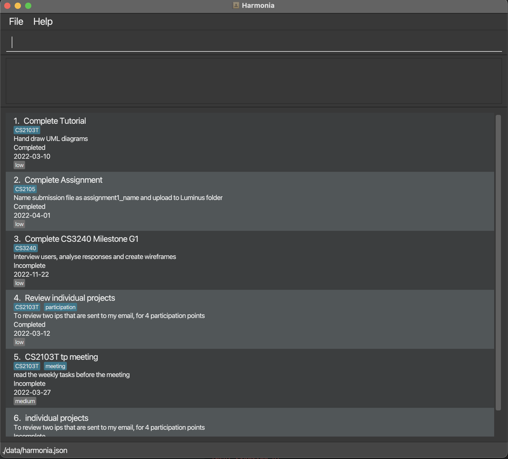
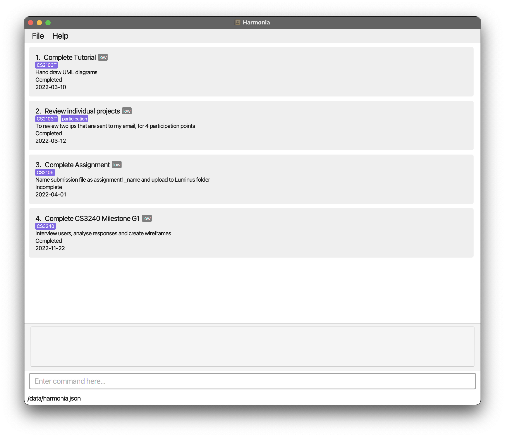
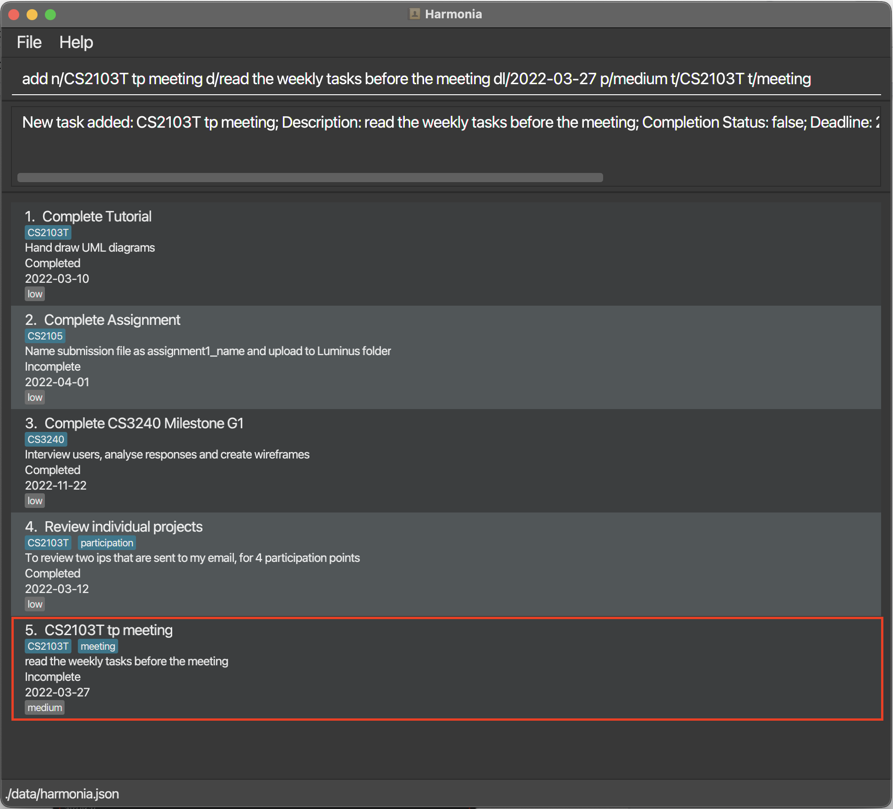

Harmonia is a **desktop app for managing tasks related to your academic life, optimized for use via a Command Line Interface (CLI)** while still having the benefits of a Graphical User Interface (GUI). If you can type fast, Harmonia can get your task management done faster than traditional GUI-based task managers. Harmonia is built by students, for students. With firsthand experience of what a student experiences, we seek to simplify the complexity associated with your academic and non-academic life.

--------------------------------------------------------------------------------------------------------------------
## Table of Contents
- [Quick Start](#quick-start)
- [Features](#features)
  - [Adding a task: add](#adding-a-task-add)
  - [Listing all tasks: list](#listing-all-tasks-list)
  - [Deleting a task: delete](#deleting-a-task-delete)
  - [Locating a task: find](#locating-a-task-find)
  - [Marking as complete: mark](#marking-as-complete--mark)
  - [Marking as complete: unmark](#marking-as-incomplete--unmark)
  - [Editing a task: edit](#editing-a-task--edit)
  - [Exiting the program: exit](#exiting-the-program--exit)
  - [Saving the data](#saving-the-data)
- [Command Summary](#command-summary)

## 1. About

### 1.1 Purpose
This user guide aims to teach you how to use Harmonia to systematically organize your student life. It walks you through all the commands Harmonia has and examples on how to use them. By the end of the guide, you should have a better understanding on how to use Harmonia to help you organise your life.

### 1.2 How to use this guide 
This guide is designed to be read from top to bottom. At the same time, this guide provides ease of navigation, where you can quickly access the segment you are looking for. To this end, the table of contents summarizes all the different sections of our user guide, and it links you to the section of the guide which you wish to look at in detail. After each section, there is also a “return to top” link which brings you back to the table of contents quickly.

### 1.3 Typography
This user guide uses different typography to denote different types of information so that you can easily know if the instruction is actionable.

#### 1.3.1 User Input 
`add n/NAME d/DESCRIPTION dl/DEADLINE p/PRIORITY [t/TAG]…`

#### 1.3.2 Keyboard Input
<kbd>↵Enter</kbd>

### 1.4 Special Symbols
This user guide denotes information that does not flow as part of the text using special symbols enclosed in a box.

#### 1.4.1 Note
Instructions or pieces of information that occur in an information box are additional information that can be useful to you.

:bulb: **Note:** This is an example note.

#### 1.4.2 Warning
Instructions that occur in a warning box you are advised to heed, or else unintended consequences may occur.

:exclamation: **Warning:** This is an example warning

### 1.5 Graphical User Interface (GUI)
Figure 1.5 depicts the user interface of Harmonia. The following descriptions explain the interface from top to bottom. 
1. At the top of Harmonia is the toolbar, where you can access the `File` and `Help` options. 
2. Below the toolbar is the **command box** where you can input your commands into. This will be the main way in which you will interact with Harmonia. 
3. The result of the command will be output into the **command result box** beneath it. This will be especially useful in helping you understand whether your command has been successfully processed by Harmonia, or if there are any errors. 
4. The mainframe of Harmonia is the **task list**, where you will be able to see all of your tasks. This frame will update accordingly to your commands, and acts as a visual representation of your data. 
5. Beneath the mainframe is the status bar, which includes the location where the data file is stored.

  
  *Figure 1.5: Harmonia's GUI*

## 2. Getting Started

1. Ensure that you have **Java 11** or above installed in your Computer.

2. Download the latest Harmonia.jar from [here](https://github.com/AY2122S2-CS2103T-T09-1/tp/releases).

3. Copy the file to the folder you want to use as the home folder for Harmonia.

4. Double-click the file to start the app. The GUI similar to *Figure 2.1* should appear in a few seconds.

   
   *Figure 2.1: Harmonia's GUI*

5. Type the command in the command box and press <kbd>↵Enter</kbd> to execute it.  
Here are a few example commands you can try:
- `list`
  - Lists out all tasks.
- `add n/CS2103T tp meeting d/read the weekly tasks before the meeting dl/2022-03-27 p/medium t/CS2103T`
  - Adds a task named `CS2103T tp meeting`, with a description of `read the weekly tasks before the meeting`. It has a deadline of `2022-03-27`, with a priority of `medium` and a tag of `CS2103T`.
- `find n/tp`
  - Finds a task with the name `tp`.

--------------------------------------------------------------------------------------------------------------------
## 3. Features

**:bulb: Notes about the command format:** 

- Words in `UPPER_CASE` are the parameters to be supplied by the user.  
  e.g. `add n/NAME`, `NAME` is a parameter which can be used as `add n/Complete Tutorial`.

- Items in square brackets are optional. 
  e.g. `find [n/NAME] [t/TAG]` can be used as `find n/Complete Tutorial` or `find t/CS203T`.

- Items followed by `...` can be used multiple times (including zero times). 
  e.g. `[t/TAG]...` can be used as `t/CS2103T t/Tutorial`.

- Parameters can be in any order. 
  e.g. if the command specifies `n/NAME d/DESCRIPTION`, `d/DESCRIPTION n/NAME` is also acceptable.

- `INDEX` refers to the numbering of an item in a list, as shown in the displayed task list. 
  e.g. in a list of tasks: 
       1. Do homework 
       2. Clean room 
       3. Walk dog 
       Index 2 here refers to the second item in the list, "Clean room".

- Extraneous parameters for commands that do not take in any parameters (such as `help` and `exit`) will be ignored. 
  e.g. if the command specifies `exit 123`, it will be interpreted as `exit`.

### 3.1 Adding a task: `add`
Adds a task into Harmonia, with a name, description, deadline, priority, and optionally some tags.

Format:  `add n/NAME d/DESCRIPTION dl/DEADLINE p/PRIORITY [t/TAG]…`
- `DEADLINE` should be in the format `‘YYYY-MM-DD’`.
- `PRIORITY` should be one of `low`, `medium`,`high`.
- `TAG` should not contain any space.

Example: `add n/CS2103T tp meeting d/read the weekly tasks before the meeting dl/2022-03-27 p/medium t/CS2103T t/meeting`

Figure 3.1: Example of Harmonia after adding a task

### 3.2 Listing all tasks: `list`

Shows a list of all the existing tasks in the task list.

Format: `list`

### 3.3 [Coming soon] Listing all tags: `list t/`

Lists all existing tags used in the task list.

Format: `list t/`

### 3.4 Deleting a task: `delete`

Deletes the task at the given index of the existing task list from Harmonia.

Format: `delete INDEX`

Example: `delete 3` deletes the 3rd task in Harmonia.

:bulb: **Note:**
You can key `list` to see the sequence of tasks in the list to check the index of the task you wish to delete.

### 3.5 Locating a task: `find`

Finds the tasks that match the given keyword(s) and is due within the time range specified from Harmonia.

Format: `find [n/NAME_KEYWORD]... [t/TAG_KEYWORD]... [start/START_DATE] [end/END_DATE]`

* If only `NAME_KEYWORD` is used, Harmonia finds the tasks whose name contains any of the `NAME_KEYWORD` specified.

* If only `TAG_KEYWORD` is used, Harmonia finds tasks whose tag contains any of the `TAG_KEYWORD` specified.

* If only `START_DATE` or `END_DATE` is used, Harmonia finds the tasks whose deadline is between the `START_DATE` and `END_DATE`.

* If only one of the `START_DATE` or `END_DATE` is specified, the unspecified field will be ignored, e.g. if only `START_DATE` is specified, then Harmonia finds all the tasks with a deadline that is not earlier than `START_DATE`.

Example: `find n/tp n/CS2103T t/meeting start/2022-03-15 end/2022-03-27`

:bulb: **Note:**
You can also search using multiple descriptors (e.g. `find n/book t/CS2103T`) to narrow down your search.

### 3.6 Marking as complete : `mark`

Marks the task at the given index of the existing task list as complete. At least 1 index has to be provided, but multiple indexes can be provided as well to mark multiple tasks as complete at a time.  

Format: `mark INDEX [INDEX]...`  
Example:  
- `mark 3` marks the task at the third index of the task list as complete.
- `mark 1 2 3` marks the tasks at the first, second and third index of the list as complete.

:bulb: **Note:**
You can key `list` to see the sequence of tasks in the list to check the index of the task you wish to mark.

### 3.7 Marking as incomplete : `unmark`

Marks the task at the given index of the existing task list as incomplete. At least 1 index has to be provided, but multiple indexes can be provided as well to mark multiple tasks as incomplete at a time.

Format: `unmark INDEX [INDEX]...`  
Example:
- `unmark 3` marks the task at the third index of the task list as incomplete.
- `unmark 1 2 3` marks the tasks at the first, second and third index of the list as incomplete.  

:bulb: **Note:**
You can key `list` to see the sequence of tasks in the list to check the index of the task you wish to unmark.

### 3.8 Editing a task : `edit`

Edits an existing task in the task list.

Format: `edit INDEX [n/NAME] [d/DESCRIPTION] [dl/DEADLINE] [p/PRIORITY] [t/TAG]...`
- `DEADLINE` should be in the format `YYYY-MM-DD`.
- `PRIORITY` should be one of `low`, `medium`, `high`.
- `TAG` should not contain any space.

Example:
- `edit 1 d/Prepare for CS2103T tutorial`
- `edit 2 n/CS2103T meeting t/CS2103T`

:bulb: **Note:**
You can key `list` to see the sequence of tasks in the list to check the index of the task you wish to edit.

### 3.9 [Coming soon] Sorting tasks : `sort`

Sorts the tasks by the specified sort key and sort order and list them out.

Format: `sort by/SORT_KEY in/SORT_ORDER`
- `SORT_KEY` is the property of the task used for sorting. Currently, supported sort keys are:
  - `deadline` - sort by the due date of the task
  - `priority` - sort by the priority of the task
  - `name` - sort by the name of the task
- `SORT_ORDER` is the order in which the tasks are listed out.
  - `ascending`
  - `descending`
  
Example:
- `sort by/deadline in/ascending`: lists the tasks with the earliest deadline first
- `sort by/priority in/descending`: lists the tasks with the highest priority first

:bulb: **Note:**
You can use the following abbreviations to sort tasks faster.
- `asc` in place of `ascending`
- `desc` in place of `descending`

### 3.10 Viewing help: `help`

Shows the link to the user guide.

Format: `help`

### 3.11 Exiting the program : `exit`

Exits the program.

Format: `exit`

### 3.12 Saving the data

Harmonia's data is saved in the hard disk automatically after any command changes the data. There is no need to save manually.

### 3.13 Editing the data file

Harmonia's data is saved as JSON file ([Location of Harmonia.jar]/data/harmonia.json). Advanced users are encouraged to update the data by editing JSON file.

:exclamation: **Caution:**
If your changes to the data file makes its format invalid, Harmonia will discard all data and start with an empty data file at the next run.

--------------------------------------------------------------------------------------------------------------------
## Command summary

Action | Format, Examples
--------|------------------
**Add** | `add n/NAME d/DESCRIPTION dl/DEADLINE p/PRIORITY [t/TAG]…`   e.g., `add n/CS2103T tp meeting d/read the weekly tasks before the meeting dl/2022-03-27 p/medium t/CS2103T t/meeting`
**Delete** | `delete INDEX`  e.g., `delete 3`
**Edit** | `edit INDEX [n/NAME] [d/DESCRIPTION] [dl/DEADLINE] [p/PRIORITY] [t/TAG]...`  e.g.,`edit 2 n/CS2101 meeting t/CS2101`
**Mark**| `mark INDEX [INDEX]...`   e.g., `mark 3`   e.g., `mark 1 2 3`
**Unmark**| `unmark INDEX [INDEX]...`   e.g., `unmark 3`   e.g., `unmark 1 2 3`
**List**| `list`   `list t/`
**Sort**| `sort by/SORT_KEY in/SORT_ORDER`   e.g., `sort by/deadline in/descending`   e.g., `sort by/priority in/asc`
**Find** | `find [n/NAME_KEYWORD]... [t/TAG_KEYWORD]... [start/START_DATE] [end/END_DATE]`   e.g., `find n/book n/read`   e.g., `find t/test t/CS2103T`   e.g., `find start/2022-03-14 end/2022-03-18`   e.g., `find t/CS2103T`   e.g., `find n/book t/test start/2022-03-15`
**Help** | `help`
**Exit** | `exit`
