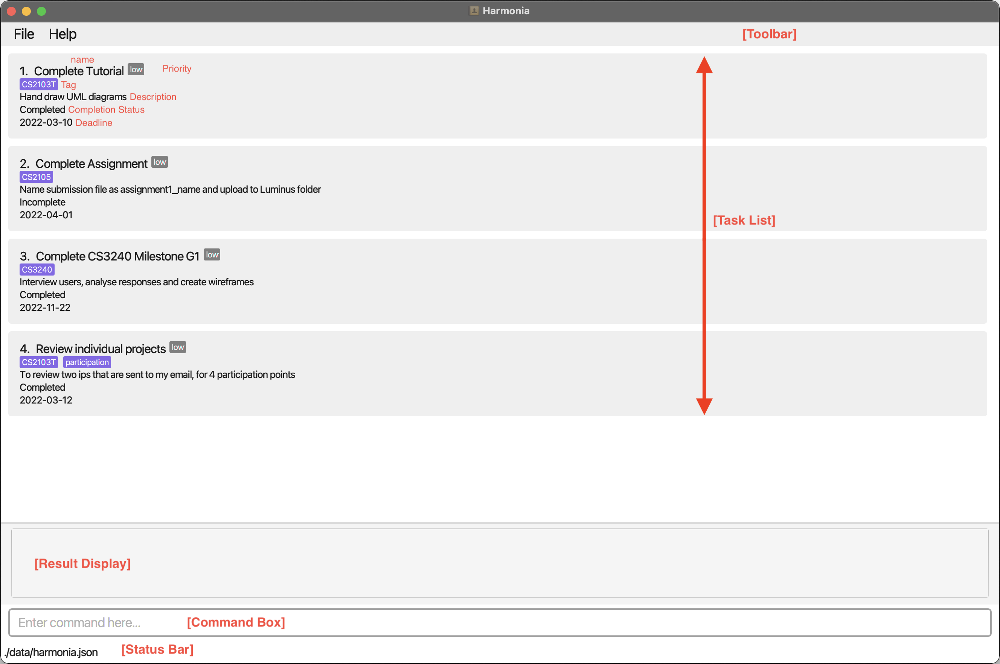
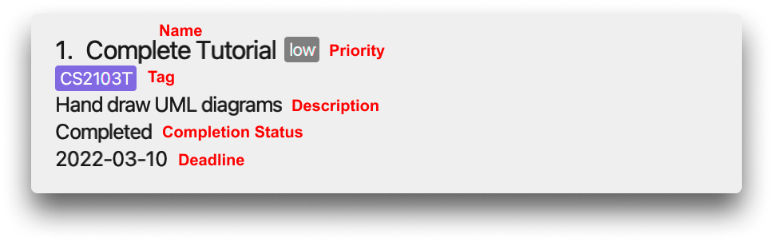
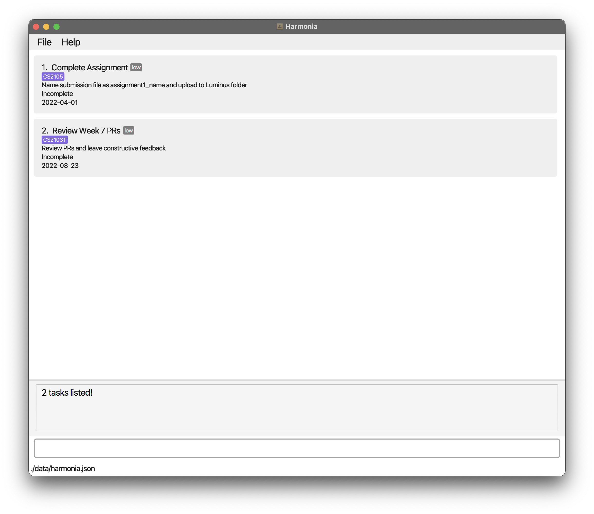
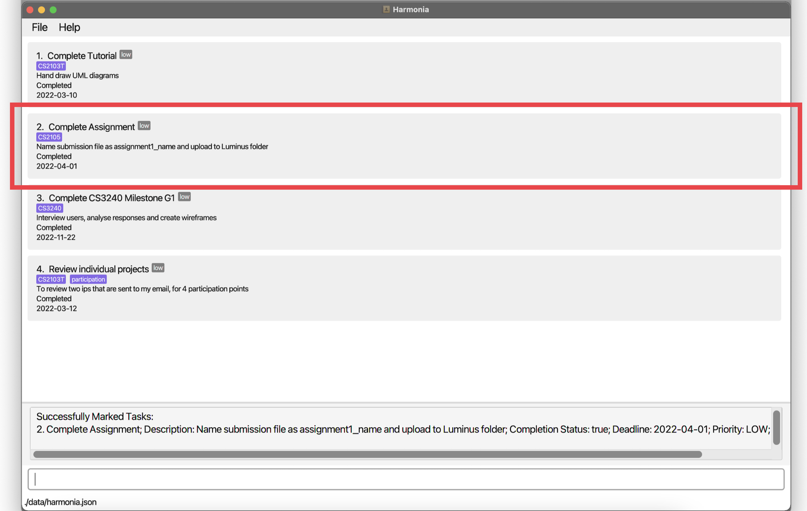
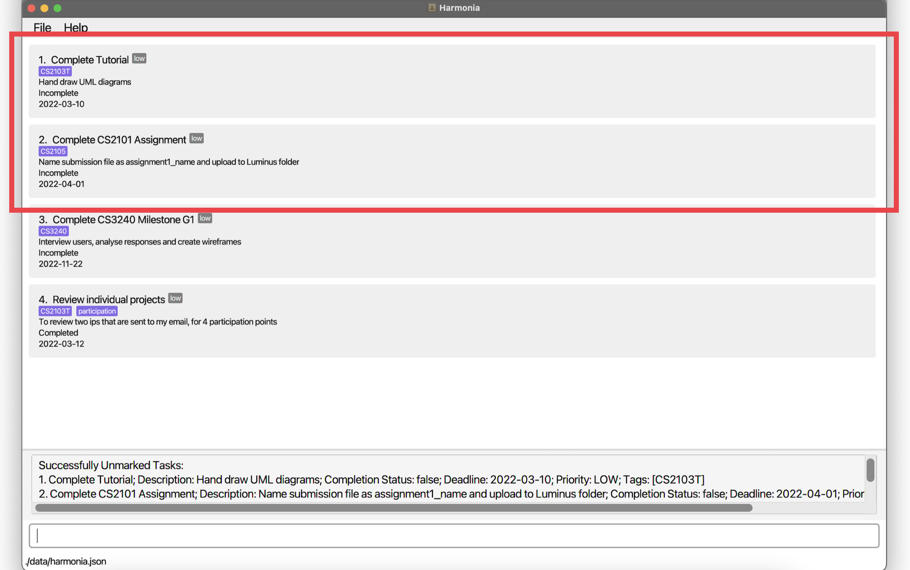
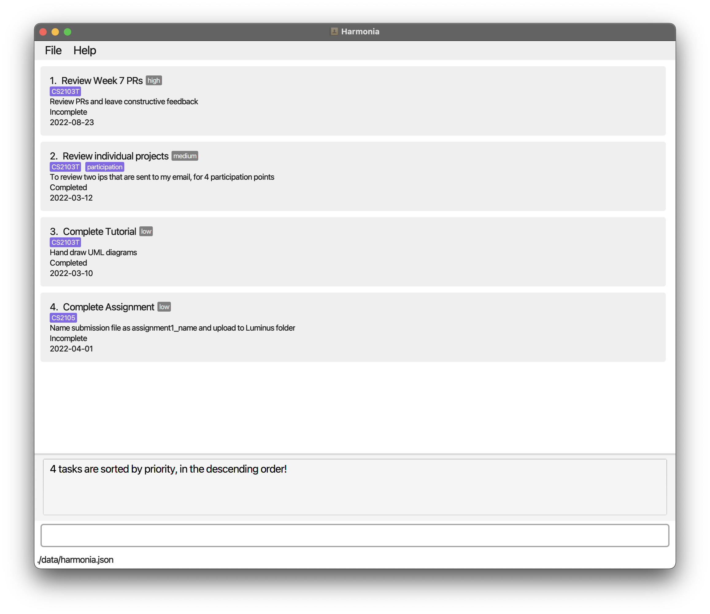

Harmonia is a **desktop app for managing tasks related to your academic life, optimized for use via a Command Line Interface (CLI)** while still having the benefits of a Graphical User Interface (GUI). If you can type fast, Harmonia can get your task management done faster than traditional GUI-based task managers. Harmonia is built by students, for students. With firsthand experience of what a student experiences, we seek to simplify the complexity associated with your academic and non-academic life.

--------------------------------------------------------------------------------------------------------------------
## Table of Contents (TOC)
1. [About](#1-about)
    1.1. [Purpose](#11-purpose)
    1.2. [How to use this guide](#12-how-to-use-this-guide)
    1.3. [Typography](#13-typography)
    &nbsp;&nbsp;&nbsp;&nbsp;&nbsp;&nbsp;&nbsp;1.3.1. [User Input](#131-user-input)
    &nbsp;&nbsp;&nbsp;&nbsp;&nbsp;&nbsp;&nbsp;1.3.2. [User Input](#132-keyboard-input)
    1.4. [Special Symbols](#14-special-symbols)
    &nbsp;&nbsp;&nbsp;&nbsp;&nbsp;&nbsp;&nbsp;1.4.1. [Note](#141-note)
    &nbsp;&nbsp;&nbsp;&nbsp;&nbsp;&nbsp;&nbsp;1.4.2. [Warning](#142-warning)
    1.5. [Graphical User Interface (GUI)](#15-graphical-user-interface-gui54-gui)
2. [Getting Started](#2-getting-started)
3. [Features](#3-features)
    3.1. [Adding a task: add](#31-adding-a-task-add)
    3.2. [Listing all tasks: list](#32-listing-all-tasks-list)
    3.3. [Listing all tags: list t/](#33-listing-all-tags53-tag-list-t)
    3.4. [Deleting a task: delete](#34-deleting-a-task-delete)
    3.5. [Locating a task: find](#35-locating-a-task-find)
    3.6. [Marking as complete: mark](#36-marking-as-complete-mark)
    3.7. [Marking as incomplete: unmark](#37-marking-as-incomplete-unmark)
    3.8. [Editing a task: edit](#38-editing-a-task-edit)
    3.9. [Sorting tasks: sort](#39-sorting-tasks-sort)
    3.10. [Viewing help: help](#310-viewing-help-help)
    3.11. [Clearing all data: clear](#311-clearing-all-data-clear)
    3.12. [Exiting the program](#312-exiting-the-program-exit)
    3.13. [Saving the data](#313-saving-the-data)
    3.14. [Editing the data file](#314-editing-the-data-file)
4. [Command Summary](#4-command-summary)
5. [Glossary](#5-glossary)
    5.1. [JSON file](#51-json-file)
    5.2 [Index](#52-index)
    5.3 [Tag](#53-tag)
    5.4 [GUI](#54-gui)

## 1. About

### 1.1 Purpose
This user guide aims to teach you how to use Harmonia to systematically organize your student life. It walks you through all the commands Harmonia has and examples on how to use them. By the end of the guide, you should have a better understanding on how to use Harmonia to help you organise your life.

### 1.2 How to use this guide
This guide is designed to be read from top to bottom. At the same time, this guide provides ease of navigation, where you can quickly access the segment you are looking for. To this end, the table of contents summarizes all the different sections of our user guide, and it links you to the section of the guide which you wish to look at in detail. After each section, there is a [Return to Top](#table-of-contents-toc) link enables you to quickly navigate back to the Table of Contents.

### 1.3 Typography
This user guide uses different typography to denote different types of information so that you can easily know if the instruction is actionable.

#### 1.3.1 User Input
This is an example of text denoted as user input: `add n/NAME d/DESCRIPTION dl/DEADLINE p/PRIORITY [t/TAG]…`

#### 1.3.2 Keyboard Input
This is an example of text denoted as keyboard input: <kbd>↵Enter</kbd>

### 1.4 Special Symbols
This user guide uses various callouts for information that either do not flow as part of the text, or are more important.

#### 1.4.1 Note
Instructions or pieces of information that occur in an information box are additional information that can be useful to you.

:bulb: **Note:** This is an example note.

#### 1.4.2 Warning
Instructions that occur in a warning box you are advised to heed, or else unintended consequences may occur.

:exclamation: **Warning:** This is an example warning

### 1.5 [Graphical User Interface (GUI)](#54-gui)
Figure 1.5 depicts the user interface of Harmonia. The following descriptions explain the interface from top to bottom.

Component | Purpose
--------|------------------
**Toolbar** | The toolbar allows you to access `File` and `Help` options.
**Task List** | The mainframe of Harmonia, where you will be able to view all of your tasks. This list will update accordingly to your commands, especially when you `find` a task, or `sort` all of your tasks.
**Result Display**| The result display is where you will find the output of your commands. This will be especially useful in helping you understand whether your command has been successfully processed by Harmonia, or if there are any errors.
**Command Box** | The Command Box will be where you can input your commands. This will be the main way in which you will interact with Harmonia.
**Status Bar**| The status bar includes the location where the data file is stored.

  
  *Figure 1.5: Harmonia's GUI*

  
  *Figure 1.6: Task Card*

[Return to Top](#table-of-contents-toc)

## 2. Getting Started

1. Ensure that you have **Java 11** or above installed in your Computer.

2. Download the latest Harmonia.jar from [here](https://github.com/AY2122S2-CS2103T-T09-1/tp/releases).

3. Copy the file to the folder you want to use as the home folder for Harmonia.

4. Double-click the file to start the app. The [GUI](#54-gui) similar to *Figure 1.5* should appear in a few seconds.

5. Type the command in the command box and press <kbd>↵Enter</kbd> to execute it. 
Here are a few example commands you can try:
- `list`
  - Lists out all tasks.
- `add n/CS2103T tp meeting d/read the weekly tasks before the meeting dl/2022-03-27 p/medium t/CS2103T`
  - Adds a task named `CS2103T tp meeting`, with a description of `read the weekly tasks before the meeting`. It has a deadline of `2022-03-27`, with a priority of `medium` and a [tag](#53-tag) of `CS2103T`.
- `find n/tp`
  - Finds a task with the name `tp`.

[Return to Top](#table-of-contents-toc)

--------------------------------------------------------------------------------------------------------------------
## 3. Features

**:bulb: Notes about the command format:**

- Words in `UPPER_CASE` are the parameters to be supplied by you. 
  e.g. `add n/NAME`, `NAME` is a parameter which can be used as `add n/Complete Tutorial`.

- Parameters can be in any order. 
  e.g. if the command specifies `n/NAME d/DESCRIPTION`, `d/DESCRIPTION n/NAME` is also acceptable.

- Items in square brackets are optional. 
  e.g. `find [n/NAME] [t/TAG]` can be used as `find n/Complete Tutorial` or `find t/CS203T`.

- Items followed by `...` can be used multiple times. 
  e.g. `[t/TAG]...` can be used as `t/CS2103T t/Tutorial`.

- [`Index`](#52-index) refers to the numbering of an item as shown in the displayed task list. 

  e.g. in a list of tasks: 
       1. Do homework 
       2. Clean room 
       3. Walk dog 
       Index 2 here refers to the second item in the list, "Clean room".

- Extraneous parameters for commands that do not take in any parameters (such as `help` and `exit`) will be ignored. 
  e.g. if you input `exit 123`, Harmonia will interpret it as `exit`.

[Return to Top](#table-of-contents-toc)

### 3.1 Adding a task: `add`
Harmonia allows you to add a task with a name, description, deadline, priority, and optionally some [tags](#53-tag).

Format:  `add n/NAME d/DESCRIPTION dl/DEADLINE p/PRIORITY [t/TAG]…`
- `DEADLINE` should be in the format `‘YYYY-MM-DD’`.
- `PRIORITY` should be `low`, `medium` or `high`.
- `TAG` should not contain any space.

Example: `add n/CS2103T tp meeting d/read the weekly tasks before the meeting dl/2022-03-27 p/medium t/CS2103T t/meeting`

Figure 3.1: Example of Harmonia after adding a task

[Return to Top](#table-of-contents-toc)

### 3.2 Listing all tasks: `list`

Harmonia allows you to see a list of all the existing tasks in the task list.

Format: `list`

[Return to Top](#table-of-contents-toc)

### 3.3 Listing all [tags](#53-tag): `list t/`

Lists all existing tags used in the task list.

Format: `list t/`

[Return to Top](#table-of-contents-toc)

### 3.4 Deleting a task: `delete`

Deletes the task at the given [index](#52-index) of the existing task list from Harmonia.

Format: `delete INDEX`

Example: `delete 3` deletes the 3rd task in Harmonia.

:bulb: **Note:**
You can key `list` to check the index of the task you wish to delete.

:exclamation: **Warning:**
This action is irreversible and all deleted tasks cannot be retrieved.

[Return to Top](#table-of-contents-toc)

### 3.5 Locating a task: `find`

Finds the tasks that match the given keyword(s) and is due within the time range specified from Harmonia.

Format: `find [n/NAME_KEYWORD]... [d/DESCRIPTION_KEYWORD]... [start/START_DATE] [end/END_DATE] [p/PRIORITY]... [t/TAG]... [c/COMPLETION_STATUS]`

* If a `NAME_KEYWORD` is supplied by you, Harmonia finds the tasks whose name contains the `NAME_KEYWORD` specified. If multiple `NAME_KEYWORD`s are supplied by you, Harmonia finds the tasks whose name contains any of the `NAME_KEYWORD`s supplied.

* If a `DESCRIPTION_KEYWORD` is supplied by you, Harmonia finds the tasks whose description contains the `DESCRIPTION_KEYWORD` specified. If multiple `DESCRIPTION_KEYWORD`s are supplied by you, Harmonia finds the tasks whose description contains any of the `DESCRIPTION_KEYWORD`s supplied.

* If both `START_DATE` and `END_DATE` are supplied by you, Harmonia finds the tasks whose deadline is between the `START_DATE` and `END_DATE` inclusive.

* If only one of either `START_DATE` or `END_DATE` is supplied by you, Harmonia ignores the unspecified field. For example, if only `START_DATE` is supplied by you, Harmonia finds all the tasks with a deadline that is after and including `START_DATE`.

* If a `PRIORITY` is supplied by you, Harmonia finds the tasks whose priority matches the `PRIORITY` supplied by you. If multiple values of `PRIORITY` are supplied by you, Harmonia finds the tasks whose priority matches any of the values of `PRIORITY` supplied.

* If a `TAG` is supplied by you, Harmonia finds tasks whose [tag(s)](#53-tag) match the `TAG` specified. If multiple `TAG`s are supplied by you, Harmonia finds the tasks whose tag(s) match any of the `TAG`s supplied.

* If a `COMPLETION_STATUS` is supplied by you, Harmonia finds tasks that match the `COMPLETION_STATUS` specified. Completion status can be either `true` or `false`.

Example: `find n/tp n/CS2103T t/meeting start/2022-03-15 end/2022-03-27 p/low p/medium c/true`

:bulb: **Note:**
You can also search using multiple descriptors (e.g. `find n/book t/CS2103T`) to narrow down your search.

Figure 3.5: Example of finding tasks after and including the date `2022-04-01`

[Return to Top](#table-of-contents-toc)

### 3.6 Marking as complete: `mark`

Harmonia allows you to mark the tasks at the given [indexes](#52-index) of the existing task list as complete. You have to provide one or more indexes to be marked.
Format: `mark INDEX [INDEX]...`
Example:
- `mark 3` marks the task at the third index of the task list as complete.
- `mark 1 2 3` marks the tasks at the first, second and third index of the list as complete.

:bulb: **Note:**
You can key `list` to check the index of the task you wish to mark.

Figure 3.6: Example of Harmonia after marking task 2

[Return to Top](#table-of-contents-toc)

### 3.7 Marking as incomplete: `unmark`

Harmonia allows you to mark the tasks at the given [indexes](#52-index) of the existing task list as incomplete. You have to provide one or more indexes to be unmarked.

Format: `unmark INDEX [INDEX]...`
Example:
- `unmark 3` marks the task at the third index of the task list as incomplete.
- `unmark 1 2 3` marks the tasks at the first, second and third index of the list as incomplete.

:bulb: **Note:**
You can key `list` to check the index of the task you wish to unmark.

Figure 3.7: Example of Harmonia after unmarking tasks 1 and 2

[Return to Top](#table-of-contents-toc)

### 3.8 Editing a task: `edit`

Harmonia allows you to edit an existing task in the task list.

Format: `edit INDEX [n/NAME] [d/DESCRIPTION] [dl/DEADLINE] [p/PRIORITY] [t/TAG]...`
- `DEADLINE` should be in the format `YYYY-MM-DD`.
- `PRIORITY` should be `low`, `medium` or `high`.
- `TAG` should not contain any space.

Example:
- `edit 1 d/Prepare for CS2103T tutorial`
- `edit 2 n/CS2103T meeting t/CS2103T`

:bulb: **Note:**
You can key `list` to check the [index](#52-index) of the task you wish to edit.

:exclamation: **Warning:**
You should include the existing tag(s) in the command when adding a new tag. Otherwise, existing tags will be overwritten. 
e.g. `edit 1 t/CS2103T t/Tutorial`, edits the tags of the task at the first index where `CS2103T` is an existing tag and `Tutorial` is a new tag to be added.

[Return to Top](#table-of-contents-toc)

### 3.9 Sorting tasks: `sort`

Sorts the tasks by the specified sort key and sort order and list them out.

Format: `sort by/SORT_KEY in/SORT_ORDER`
- `SORT_KEY` is the property of the task used for sorting. Currently, supported sort keys are:
  - `deadline` - sort by the due date of the task
  - `priority` - sort by the priority of the task
  - `name` - sort by the name of the task
- `SORT_ORDER` is the order in which the tasks are listed out.
  - `asc` - sort in ascending order
  - `desc` - sort in descending order

Example:
- `sort by/deadline in/asc`: lists the tasks with the earliest deadline first
- `sort by/priority in/desc`: lists the tasks with the highest priority first

:bulb: **Note:**
The tasks will preserve the specified sorting until a different `sort` command is given.

Figure 3.9: Example of Harmonia after sorting tasks in descending order

[Return to Top](#table-of-contents-toc)

### 3.10 Viewing help: `help`

Shows the link to the user guide.

Format: `help`

[Return to Top](#table-of-contents-toc)

### 3.11 Clearing all data: `clear`

Harmonia allows you to clear all tasks in the task list.

Format: `clear`

:exclamation: **Warning:**
Do not use the clear command unless you are certain that you wish to erase all data. This action is irreversible and all erased data cannot be retrieved.

[Return to Top](#table-of-contents-toc)

### 3.12 Exiting the program: `exit`

Exits the program.

Format: `exit`

[Return to Top](#table-of-contents-toc)

### 3.13 Saving the data

Harmonia's data is saved in the hard disk automatically after any command changes the data. There is no need to save manually.

[Return to Top](#table-of-contents-toc)

### 3.14 Editing the data file

Harmonia's data is saved as [JSON](#51-json-file) file ([Location of Harmonia.jar]/data/harmonia.json). Advanced users are encouraged to update the data by editing JSON file.

:exclamation: **Caution:**
If your changes to the data file makes its format invalid, Harmonia will discard all data and start with an empty data file at the next run.

[Return to Top](#table-of-contents-toc)

--------------------------------------------------------------------------------------------------------------------
## 4. Command summary

Action | Format, Examples
--------|------------------
**Add** | `add n/NAME d/DESCRIPTION dl/DEADLINE p/PRIORITY [t/TAG]…`   e.g., `add n/CS2103T tp meeting d/read the weekly tasks before the meeting dl/2022-03-27 p/medium t/CS2103T t/meeting`
**Delete** | `delete INDEX`  e.g., `delete 3`
**Edit** | `edit INDEX [n/NAME] [d/DESCRIPTION] [dl/DEADLINE] [p/PRIORITY] [t/TAG]...`  e.g.,`edit 2 n/CS2101 meeting t/CS2101`
**Mark**| `mark INDEX [INDEX]...`   e.g., `mark 3`   e.g., `mark 1 2 3`
**Unmark**| `unmark INDEX [INDEX]...`   e.g., `unmark 3`   e.g., `unmark 1 2 3`
**List**| `list`   `list t/`
**Sort**| `sort by/SORT_KEY in/SORT_ORDER`   e.g., `sort by/deadline in/desc`   e.g., `sort by/priority in/asc`
**Find** | `find [n/NAME_KEYWORD]... [t/TAG_KEYWORD]... [start/START_DATE] [end/END_DATE]`   e.g., `find n/book n/read`   e.g., `find t/test t/CS2103T`   e.g., `find start/2022-03-14 end/2022-03-18`   e.g., `find t/CS2103T`   e.g., `find n/book t/test start/2022-03-15`
**Help** | `help`
**Clear** | `clear`
**Exit** | `exit`

[Return to Top](#table-of-contents-toc)

## 5. Glossary

### 5.1 JSON file

[JSON (JavaScript Object Notation](https://www.json.org/json-en.html), is an open standard file format and data interchange format that uses human-readable text to store and transmit data objects consisting of attribute–value pairs and arrays (or other serializable values). [(Source: Wikipedia)](https://en.wikipedia.org/wiki/JSON)

In Harmonia, a JSON file is used to store the list of tasks. For each task, the JSON file stores the mapping between attributes (e.g. task name, description, etc.) and their values. If you are an advanced user, you may choose to update the data by editing the JSON file.

[Return to Top](#table-of-contents-toc)

### 5.2 Index

Harmonia uses indexes to help you address a task easily. An `Index` refers to the numbering of an item in a list, as shown in the displayed task list. 

For example,  in a list of tasks: 
1. Do homework 
2. Clean room 
3. Walk dog 
Index 2 here refers to the second item in the list, "Clean room".

[Return to Top](#table-of-contents-toc)

### 5.3 Tag

Harmonia uses tags to help you categorize your tasks. You may optionally assign one or more tags to a task through [Adding a task: add](#31-adding-a-task-add), and find your tasks with specified tag(s) through [Locating a task: find](#35-locating-a-task-find).

[Return to Top](#table-of-contents-toc)

### 5.4 GUI

The graphical user interface (GUI) is a form of user interface that allows users to interact with electronic devices through graphical icons and audio indicator such as primary notation, instead of text-based user interfaces, typed command labels or text navigation. [(Source: Wikipedia)](https://en.wikipedia.org/wiki/Graphical_user_interface)

Harmonia uses a simple GUI to help you interact with the application, while preserving the benefits of command line interface (CLI).

[Return to Top](#table-of-contents-toc)
